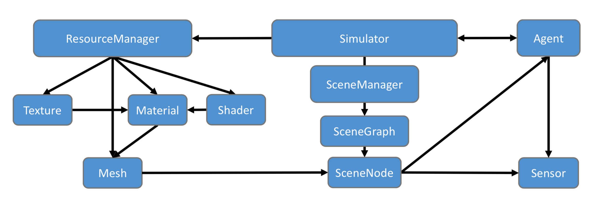
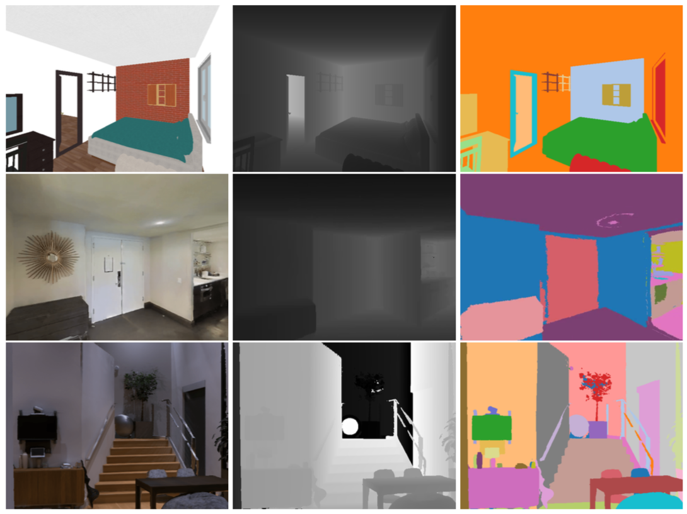

## Details

The Habitat-Sim backend module is implemented in C++ and leverages the [magnum](https://github.com/mosra/magnum) graphics middleware library to support cross-platform deployment on a broad variety of hardware configurations. The architecture of the main abstraction classes is shown below. The design of this module ensures a few key properties:
* Memory-efficient management of 3D environment resources (triangle mesh geometry, textures, shaders) ensuring shared resources are cached and re-used
* Flexible, structured representation of 3D environments using SceneGraphs, allowing for programmatic manipulation of object state, and combination of objects from different environments
* High-efficiency rendering engine with multi-attachment render passes for reduced overhead when multiple sensors are active
* Arbitrary numbers of Agents and corresponding Sensors that can be linked to a 3D environment by attachment to a SceneGraph.

<p align="center">
 
 <p align="center"><i>Architecture of <code>Habitat-Sim</code> main classes</i></p>
</p>

The Simulator delegates management of all resources related to 3D environments to a ResourceManager that is responsible for loading and caching 3D environment data from a variety of on-disk formats. These resources are used within SceneGraphs at the level of individual SceneNodes that represent distinct objects or regions in a particular Scene. Agents and their Sensors are instantiated by being attached to SceneNodes in a particular SceneGraph.

<p align="center">
 
 <p align="center"><i>Example rendered sensor observations</i></p>
</p>

## Performance
The table below reports performance statistics for a test scene from the Matterport3D dataset (id `17DRP5sb8fy`) on a `Xeon E5-2690 v4 CPU` and `Nvidia Titan Xp`. Single-thread performance reaches several thousand frames per second, while multi-process operation with several independent simulation backends can reach more than 10,000 frames per second on a single GPU!
<table class="table" id="fps_table">
 <tr>
   <td></td>
   <th colspan="3"> 1 proc </th>
   <th colspan="3"> 3 procs </th>
   <th colspan="3"> 5 procs </th>
 </tr>
 <tr>
   <th>Sensors / Resolution</th>
   <th>128</th>
   <th>256</th>
   <th>512</th>
   <th>128</th>
   <th>256</th>
   <th>512</th>
   <th>128</th>
   <th>256</th>
   <th>512</th>
 </tr>
 <tr>
   <td>RGB</td>
   <td>4093</td>
   <td>1987</td>
   <td>848</td>
   <td>10638</td>
   <td>3428</td>
   <td>2068</td>
   <td>10592</td>
   <td>3574</td>
   <td>2629</td>
 </tr>
 <tr>
   <td>RGB + depth</td>
   <td>2050</td>
   <td>1042</td>
   <td>423</td>
   <td>5024</td>
   <td>1715</td>
   <td>1042</td>
   <td>5223</td>
   <td>1774</td>
   <td>1348</td>
 </tr>
 <tr>
   <td>RGB + depth + semantics*</td>
   <td>709</td>
   <td>596</td>
   <td>394</td>
   <td>1312</td>
   <td>1219</td>
   <td>979</td>
   <td>1521</td>
   <td>1429</td>
   <td>1291</td>
 </tr>
</table>

Previous simulation platforms that have operated on similar datasets typically produce on the order of a couple hundred frames per second. For example [Gibson](https://github.com/StanfordVL/GibsonEnv#gibson-framerate) reports up to about 150 fps with 8 processes, and [MINOS](https://github.com/minosworld/minos#benchmarking) reports up to about 167 fps with 4 threads.

*Note: The semantic sensor in MP3D houses currently requires the use of additional house 3D meshes with orders of magnitude more geometric complexity leading to reduced performance. We expect this to be addressed in future versions leading to speeds comparable to RGB + depth; stay tuned.

## Rendering to GPU Tensors

We support transferring rendering results directly to a [PyTorch](https://pytorch.org/) tensor via CUDA-GL Interop.
This feature is built by when Habitat-Sim is compiled with CUDA, i.e. built with `--with-cuda`.  To enable it, set the
`gpu2gpu_transfer` flag of the sensor specification(s) to `True`

This is implemented in a way that is reasonably agnostic to the exact GPU-Tensor library being used, but we currently have only implemented support for PyTorch.


## Experimental: Emscripten, WebGL, and Web Apps

Build `hsim_bindings.wasm`, our experimental Emscripten-compiled webassembly binary for use in WebGL html/Javascript apps. See the available Javascript bindings at `src/esp/bindings_js/bindings_js.cpp`. Check out our `bindings.html` demo app:

1. Download the [test scenes](http://dl.fbaipublicfiles.com/habitat/habitat-test-scenes.zip) and extract locally to habitat-sim creating habitat-sim/data.
1. Download and install [emscripten](https://emscripten.org/docs/getting_started/downloads.html) (you need version 1.38.48).

   In the `emsdk` repository:
   ```bash
   git pull
   ./emsdk install 1.38.48
   ```
1. Activate your emsdk environment
   ```bash
   ./emsdk activate 1.38.48
   source ./emsdk_env.sh
   ```
1. Use Node v11.9.0

   Install `nvm` from here: https://github.com/nvm-sh/nvm#installing-and-updating
   ```bash
   nvm install v11.9.0
   nvm use v11.9.0
   ```
1. Build using `./build_js.sh [--bullet]`
1. Run webserver
   ```bash
   python -m http.server 8000 --bind 127.0.0.1
   ```
1. Open <http://127.0.0.1:8000/build_js/esp/bindings_js/bindings.html>

You can build `hsim_bindings.wasm` without the demo web apps like so:
- `./build_js.sh --no-web-apps [--bullet]`
