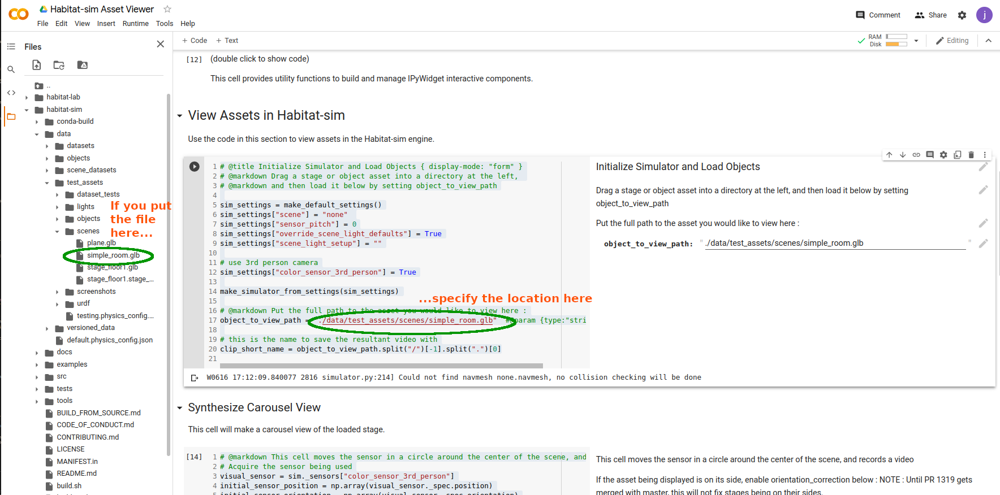
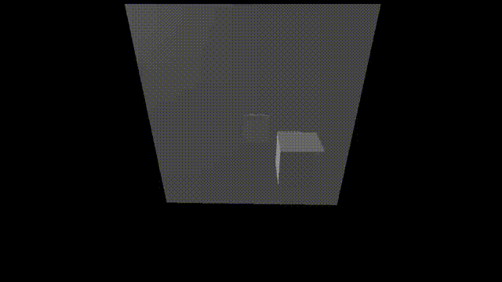
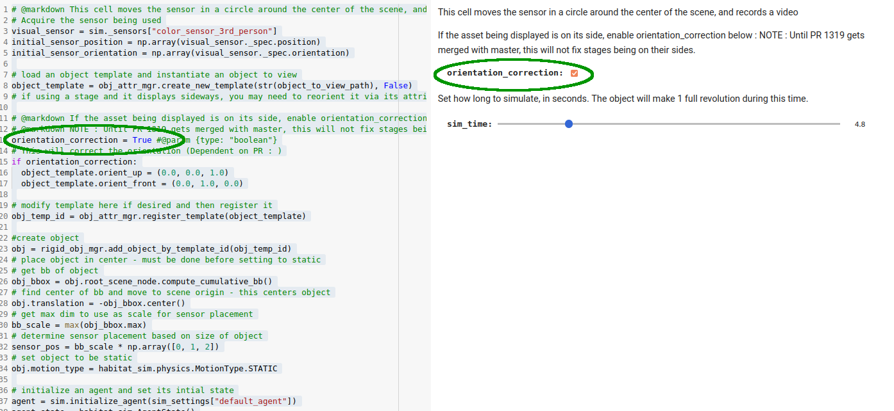
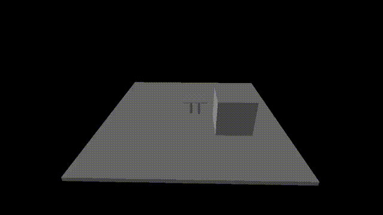

View Assets in Habitat-Sim
##########################

:ref-prefix:
    habitat_sim.simulator
    habitat_sim.sim

:summary: This short tutorial demonstrates how to view assets in Habitat-Sim using the Asset Viewer.

.. contents::
    :class: m-block m-default

`View Assets in Habitat-sim engine`_
====================================

When composing or editing assets for a habitat dataset, it would be helpful to see how they would be rendered in the Habitat-sim engine.  This can be difficult to accomplish without a lot of setup work, and this is made more difficult if Habitat-sim is not installed.
This tutorial describes the Asset Viewer tool, which exists as both a `Colab`_, and a pure python utility.

.. _Colab: https://colab.research.google.com/github/facebookresearch/habitat-sim/blob/main/examples/tutorials/colabs/asset_viewer.ipynb

.. code:: shell-session

    $ python path/to/habitat-sim/examples/tutorials/nb_python/asset_viewer.py

Here we initialize the :ref:`Simulator`. Note that we override default settings to use the internally defined "none" scene (which is empty), and the 3rd person camera, before we initialize the :ref:`Simulator`.

.. include:: ../../examples/tutorials/nb_python/asset_viewer.py
    :code: py
    :start-after: # [initialize]
    :end-before: # [/initialize]

`Upload an Asset and Choose it for Display`_
============================================

To specify the asset to be viewed, set 'object_to_view_path' to be the full path to the asset.  If executing this tool as a Google colab,
you can upload an asset file to a location in the directory structure to the left of the screen, as is shown in the image below.

.. include:: ../../examples/tutorials/nb_python/asset_viewer.py
    :code: py
    :start-after: # [specify_object]
    :end-before: # [/specify_object]

`View the Asset, and Correct Inappropriate Orientation`_
========================================================

This code will compose a video of the asset of user-specified length that will show a single revolution around the asset.

.. include:: ../../examples/tutorials/nb_python/asset_viewer.py
    :code: py
    :start-after: # [build_carousel_view]
    :end-before: # [/build_carousel_view]

Assets will be displayed enlarged to nearly fill the screen, regardless of their size.

You may find that the asset is displayed on its side (this will often be the case if the asset is a stage).

If this is the case, set orientation_correction to True.

This will correct the orientation issues.

