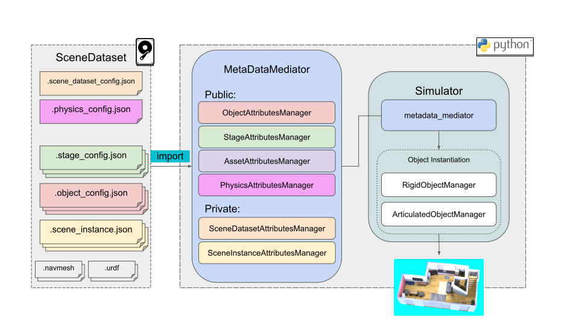

Using JSON Files to configure Attributes
########################################

:ref-prefix:
    habitat_sim.sim
    habitat_sim.simulator
    habitat_sim.attributes
    habitat_sim.attributes_managers
    habitat_sim.metadata
    habitat_sim.physics

:summary: This document details the appropriate tags to be used when authoring JSON files to properly customize SceneDataset attributes templates.

.. contents::
    :class: m-block m-default

`SceneDataset Overview`_
===========================

A *SceneDataset* is a metadata configuration structure which defines system parameters, links a set of available assets, and organizes them together into one or many scene descriptions which can be instanced in the :ref:`Simulator`.

All necessary configuration can be done as a pre-process via the JSON configuration files described on this documentation page.

    A *SceneDataset* system diagram illustrating the correspondence between JSON configs and programmatic structures. Note that the *Simulator* controls instantiation of objects by accessing data cached within its internal *MetadataMediator*.

Programmatically, a *SceneDataset* consists of sets of *Attributes* objects detailing the configuration of individual objects, stages, scenes etc... which can be modified via C++ and python APIs (:ref:`habitat_sim.attributes`) and managed by *AttributeManager* APIs (:ref:`habitat_sim.attributes_managers`).

These *Attributes* objects are imported from their corresponding .json files. See `ReplicaCAD <https://aihabitat.org/datasets/replica_cad/index.html>`_ for an example of a complete SceneDataset JSON config structure.

The :ref:`MetadataMediator` aggregates all *AttributesManagers* and provides an API for swapping the active *SceneDataset*. It can exist independent of a :ref:`Simulator` object for programmatic metadata management and can be passed into the constructor via the :ref:`SimulatorConfiguration`.

The remaining documentation on this page details the *SceneDataset* JSON configuration options available at this time.

`SceneDatasetAttributes`_
=========================
A *SceneDataset* enumerates and aggregates the various assets and metadata necessary to fully describe a set of stages, objects, and/or scenes. :ref:`SceneDatasetAttributes` templates hold relative filepaths to all linked assets and additional configs. Any source configuration files used to build these attributes should be named using the following format:

     <datasetname>.scene_dataset_config.json

`An example of an appropriately configured SceneDataset Attributes file can be found below <facebookresearch/habitat-sim/blob/main/data/test_assets/dataset_tests/dataset_0/test_dataset_0.scene_dataset_config.json>`_:

.. include:: ../../data/test_assets/dataset_tests/dataset_0/test_dataset_0.scene_dataset_config.json
    :code: json

Configuring Child Attributes
----------------------------

Stages, Objects, Lights, and Scenes can be linked from .json, created directly from assets (e.g. .glb) or configured directly in this file's configuration nodes via the syntax below:

"stages" \| "objects" \| "articulated_objects" \| "light_setups" \| "scene_instances"
    - JSON object
    - Configuration pertaining to the specified attribute type.

    - "default_attributes"
        - JSON object
        - Set default attributes for all like objects in the dataset. Individual JSON instances can override these values. See StageAttributes, ObjectAttributes, etc... below.
    - "paths"
        - JSON object
        - keyed by file extension to search for. Value is a list of paths relative to this file to search for the designated filetype.
    - "configs"
        - list of JSON objects
        - Define modified copies or completely new Attributes objects directly in the SceneDatasetAttributes. See StageAttributes, ObjectAttributes, etc... below.
            - "original_file"
                - string
                - If provided, creates a duplicate of the linked *_config.json*
            - "template_handle"
                - string
                - Handle/name for the new *Attributes*. Used to reference it within its *AttributesManager*.
            -  "attributes"
                - JSON object
                - Attribute configuration to override defaults or copied values.

"semantic_scene_descriptor_instances" \| "navmesh_instances"
    - JSON object
    - key\|value pairs link handles to relative filepaths for all Semantic Scene Descriptor (SSD) and NavMesh files. These can then be referenced by name within `SceneInstanceAttributes`.

`SceneInstanceAttributes`_
==========================
A *Scene* is a single 3D world composed of a STATIC *stage* and a variable number of *objects*, *Agents*, and *Sensors*. The *SceneInstanceAttributes* pulls together other assets registered in the *SceneDataset* to form a cohesive 3D world for simulation. Any source configuration files used to build these attributes should be named using the following format:

    <scenename>.scene_instance.json

An example of an appropriately configured SceneInstanceAttributes files can be found in the `ReplicaCAD dataset <https://aihabitat.org/datasets/replica_cad/index.html>`_ (*apt_0.scene_instance.json*). Abbreviated for brevity:

.. code:: json

    {
        "stage_instance": {
            "template_name": "stages/frl_apartment_stage"
        },
        "default_lighting": "lighting/frl_apartment_stage",
        "object_instances": [
            {
                "template_name": "objects/frl_apartment_basket",
                "motion_type": "DYNAMIC",
                "translation": [
                    -1.9956579525706273,
                    1.0839370509764081,
                    0.057981376432922185
                ],
                "rotation": [
                    0.9846951961517334,
                    -5.20254616276361e-07,
                    0.17428532242774963,
                    3.540688453540497e-07
                ]
            },

            ...

        ],
        "articulated_object_instances": [
            {
                "template_name": "fridge",
                "translation_origin": "COM",
                "fixed_base": true,
                "translation": [
                    -2.1782121658325195,
                    0.9755649566650391,
                    3.2299728393554688
                ],
                "rotation": [
                    1,
                    0,
                    0,
                    0
                ],
                "motion_type": "DYNAMIC"
            },

            ...

        ],
        "navmesh_instance": "empty_stage_navmesh"
    }

Stage Instance
--------------

"stage_instance"
    - JSON object
    - Each scene can support one stage instance.
        - "template_name"
            - string
            - The handle of the stage as defined in the SceneDataset. Often the relative filepath between the .scene_dataset_config.json and the .stage_config.json.
        - "translation"
            - 3-vector
            - Apply an offset to the stage default origin for the scene (e.g. to center the origin at some specific location in the stage).
        - "rotation"
            - 4-vector (quaternion wxyz)
            - Apply a rotation to the stage default frame within the scene.
        - "shader_type"
            - string
            - (override) key of the shader type preferred to render the stage asset.
        - "uniform_scale"
            - float
            - A uniform scaling value to apply to the stage asset.
        - "non_uniform_scale":
            - 3-vector
            - A non-uniform scale vector to apply in addition to the uniform scale.

Object Instances
----------------

All rigid and articulated objects instanced in the scene during initialization should be listed and configured here.

"object_instances"
    - list of JSON objects
    - List all rigid object instances within the scene.
        - "template_name"
            - string
            - The handle of the object as defined in the SceneDataset. Often the relative filepath between the .scene_dataset_config.json and the .object_config.json.
        - "translation"
            - 3-vector
            - Translation of the object instance.
        - "rotation"
            - 4-vector (quaternion wxyz)
            - Orientation of the object instance.
        - "motion_type"
            - string
            - One of the defined :ref:`MotionType` s, (STATIC, KINEMATIC, DYNAMIC).
        - "uniform_scale"
            - float
            - A uniform scaling value to apply to the object asset.
        - "non_uniform_scale"
            - 3-vector
            - A non-uniform scale vector to apply in addition to the uniform scale.
        - "translation_origin"
            - string
            - One of ('COM', 'asset_local'). Defines whether the translation provided for this object instance is applied in render asset local space or center of mass (COM) aligned space. All rigid object translations within Habitat-sim are in COM space, but external translations (e.g. exported from Blender) may not be.

"articulated_object_instances"
    - list of JSON objects
    - List of all articulated object instances within the scene.
        - "template_name"
            - string
            - The handle of the object as defined in the SceneDataset. Often the relative filepath between the .scene_dataset_config.json and the .urdf.
        - "fixed_base"
            - boolean
            - Whether or not the base link translation and rotation is static.
        - "auto_clamp_joint_limits"
            - boolean
            - Whether or not to automatically clamp joint positions back within their limits at the end of each simulation step.
        - "translation"
            - 3-vector
            - Translation of the object instance's base.
        - "rotation"
            - 4-vector (quaternion wxyz)
            - Orientation of the object instance's base.
        - "motion_type"
            - string
            - One of the defined :ref:`MotionType` s, (STATIC, KINEMATIC, DYNAMIC).
        - "uniform_scale"
            - float
            - A uniform scaling value to apply to the object asset.
        - "non_uniform_scale"
            - 3-vector
            - A non-uniform scale vector to apply in addition to the uniform scale.
        - "mass_scale"
            - float
            - Mass does not scale linearly with object scale, so you can customize this.
        - "translation_origin"
            - string
            - One of ('COM', 'asset_local'). Defines whether the translation provided for this object instance is applied in render asset local space or center of mass (COM) aligned space.
        - "initial_joint_pose"
            - JSON object or list
            - The initial joint state of the articulated object. If a list, should be the full set of joint positions as floats. If an object, key\|value pairs map individual joint names to positions.
        - "initial_joint_velocities"
            - JSON object or list
            - The initial joint velocity state of the articulated object. If a list, should be the full set of joint velocities as floats. If an object, key\|value pairs map individual joint names to velocities.

Other Features
--------------

Additionally, a scene can link a NavMesh, semantic scene descriptor (SSD), and lighting configuration.

"default_lighting"
    - string
    - The handle referencing the desired lighting setup as defined in the SceneDataset config. Empty string '""' is default lighting. '"no_lights"'' specifies flat shading.

"navmesh_instance"
    - string
    - The handle referencing the .navmesh asset as defined in the SceneDataset config.

"semantic_scene_instance"
    - string
    - The handle referencing the SSD file as defined in the SceneDataset config.

`StageAttributes`_
==================
A *stage* in Habitat-Sim is the set of STATIC mesh components which make up the backdrop of a *Scene*. For example, a 3D scan mesh asset or the architectural elements (floor, walls, stairs, etc...) of an interactive scene. :ref:`StageAttributes` templates hold relevant information describing a stage's render and collision assets and physical properties.  Any source configuration files used to build these attributes should be named using the following format:

     <stagename>.stage_config.json

`An example of an appropriately configured Stage Attributes file can be found below <facebookresearch/habitat-sim/blob/main/data/test_assets/scenes/stage_floor1.stage_config.json>`_:

.. include:: ../../data/test_assets/scenes/stage_floor1.stage_config.json
    :code: json

Stage Mesh Handles And Types
----------------------------

Below are the handles and descriptors for various mesh assets used by a stage.

"render_asset"
    - string
    - The name of the file describing the render mesh to be used by the stage.
"collision_asset"
    - string
    - The name of the file describing the collision mesh to be used by the stage.
"semantic_asset"
    - string
    - The name of the file describing the stage's semantic mesh.
"nav_asset"
    - string
    - The name of the file describing the stage's nav mesh.
"semantic_descriptor_filename"
    - string
    - The name of the file describing the semantic mappings for the stage.

Stage Frame and Origin
----------------------

The tags below are used to build a coordinate frame for the stage, and will override any default values set based on render mesh file name/extension.  If either **"up"** or **"front"** are specified, both must be provided and they must be orthogonal.

"up"
    - 3-vector
    - Describes the **up** direction for the stage in the asset's local space.
"front"
    - 3-vector
    - Describes the **forward** direction for the stage in the asset's local space.
"semantic_up"
    - 3-vector
    - Describes the **up** direction for the stage's **semantic mesh** in the asset's local space. If specified, the frame built from this vector will be used instead of the render asset's frame.
"semantic_front"
    - 3-vector
    - Describes the **forward** direction for the stage's **semantic mesh** in the asset's local space. If specified, the frame built from this vector will be used instead of the render asset's frame.
"origin"
    - 3-vector
    - Describes the **origin** of the stage in the world frame, for alignment purposes.

Stage Physics and Object-related Parameters
-------------------------------------------

Below are stage-specific physical and object-related quantities.  These values will override similarly-named values specified in the Physics Manager Attributes.

"scale"
    - 3-vector
    - The default scale to be used for the stage.
"gravity"
    - 3-vector
    - Gravity to use for physical modeling.
"is_collidable"
    - boolean
    - Whether the stage should be added to the collision and physics simulation world upon instancing.
"force_flat_shading"
    - boolean
    - Whether the stage should be rendered with a flat shader. If this is set to true, it will override any shader_type specifications.
"shader_type"
    - string (one of "material", "flat", "phong", "pbr")
    - The shader to be used to render the stage. 'material' uses the render asset's specified material, other values force specified shader regardless of asset specification.
"margin"
    - double
    - Distance margin for collision calculations.
"friction_coefficient"
    - double
    - The coefficient of friction.
"restitution_coefficient"
    - double
    - The coefficient of restitution.
"units_to_meters"
    - double
    - The conversion of given units to meters.

`ObjectAttributes`_
===================
:ref:`ObjectAttributes` templates hold descriptive information for instancing rigid objects into Habitat-Sim.  These file names should be formatted as follows:

     <objectname>.object_config.json

`An example of an appropriately configured Object Attributes file can be found below <facebookresearch/habitat-sim/blob/main/data/test_assets/objects/donut.object_config.json>`_:

.. include:: ../../data/test_assets/objects/donut.object_config.json
    :code: json

Object Mesh Handles And Types
-----------------------------

Below are the handles and descriptors for various mesh assets used by an object.

"render_asset"
    - string
    - The name of the file describing the render mesh to be used by the object.
"collision_asset"
    - string
    - The name of the file describing the collision mesh to be used by the object.
"collision_asset_size"
    - 3-vector
    - Size of collision asset, to allow it to be scaled to fit render asset

Object Frame and Origin
-----------------------

The tags below are used to build a coordinate frame for the object, and will override any default values set based on render mesh file name/extension.  If either **"up"** or **"front"** are specified, both must be provided and they must be orthogonal.  The object's COM is used as its origin.

"up"
    - 3-vector
    - Describes the **up** direction for the object in the asset's local space.
"front"
    - 3-vector
    - Describes the **forward** direction for the object in the asset's local space.

Below are object-specific physical quantities.  These values will override similarly-named values specified in a Physics Manager Attributes.

"scale"
    - 3-vector
    - The default scale to be used for the object.
"is_collidable"
    - boolean
    - Whether the object should be added to the simulation world with a collision shape upon instancing.
"margin"
    - double
    - Distance margin for collision calculations.
"friction_coefficient"
    - double
    - The coefficient of friction.
"rolling_friction_coefficient"
    - double
    - The coefficient of rolling friction. Damps angular velocity about axis orthogonal to the contact normal to prevent rounded shapes from rolling forever.
"spinning_friction_coefficient"
    - double
    - The coefficient of spinning friction. Damps angular velocity about the contact normal.
"restitution_coefficient"
    - double
    - The coefficient of restitution.
"units_to_meters"
    - double
    - The conversion of given units to meters.
"force_flat_shading"
    - boolean
    - Whether the object should be rendered with a flat shader. If this is set to true, it will override any shader_type specifications.
"shader_type"
    - string (one of "material", "flat", "phong", "pbr")
    - The shader to be used to render the object. 'material' uses the render asset's specified material, other values force specified shader regardless of asset specification.
"mass"
    - double
    - The mass of the object, for physics calculations.
"inertia"
    - 3-vector
    - The values of the diagonal of the inertia matrix for the object.  If not provided, will be computed automatically from the object's mass and bounding box.
"COM"
    - 3-vector
    - The center of mass for the object.  If this is not specified in JSON, it will be derived from the object's bounding box in Habitat-Sim.
"use_bounding_box_for_collision"
    - boolean
    - Whether or not to use the object's bounding box as collision geometry. Note: dynamic simulation will be significantly faster and more stable if this is true.
"join_collision_meshes"
    - boolean
    - Whether or not sub-components of the object's collision asset should be joined into a single unified collision object.
"semantic_id"
    - integer
    - The semantic id assigned to objects made with this configuration.

`LightLayoutAttributes`_
========================
:ref:`LightLayoutAttributes` templates hold descriptive information for light setups to be instanced in Habitat-Sim.  The file names for these JSON should be formatted as follows:

     <lightingname>.lighting_config.json

`An example of an appropriately configured LightLayoutAttributes file can be found below <facebookresearch/habitat-sim/blob/main/data/test_assets/lights/test_lights.lighting_config.json>`_:

.. include:: ../../data/test_assets/lights/test_lights.lighting_config.json
    :code: json

The :ref:`LightLayoutAttributes` JSON should contain a single cell named "lights" that references a JSON object consisting of key-value pairs, where each key is a string ID that is unique to the lighting layout to be used as an identifier,
 and the value is a JSON object containing appropriate key-value combinations of the following data for the light type being described.

"position"
    - 3-vector
    - The position of the light, if the light is a point light.
"direction"
    - 3-vector
    - The direction of the light, if the light is a directional light.
"color"
    - 3-vector [R,G,B; each value 0->1]
    - RGB value for the light's color in linear space.
"intensity"
    - float
    - The intensity of the light. This color is multiplied by this value to account for rolloff.  Negative values are allowed and can be used to simulate shadows.
"type"
    - string
    - The type of the light.  "point" and "directional" are currently supported.
"position_model"
  - string
  - The frame to use to place the light. "global", meaning stage's origin, and "camera", meaning place relative to a (potentially moving) camera, are currently supported.

`PhysicsManagerAttributes`_
===========================
:ref:`PhysicsManagerAttributes` templates describe quantities pertinent to building the simulation world.  Any source configuration JSON files used to build these attributes should be formatted as follows:

     <worldname>.physics_config.json

`An example of an appropriately configured Physics Manager Attributes file can be found below <facebookresearch/habitat-sim/blob/main/data/test_assets/testing.physics_config.json>`_:

.. include:: ../../data/test_assets/testing.physics_config.json
    :code: json

Below are the supported JSON tags for Physics Manager Attributes templates, and their meanings.

"physics_simulator"
    - string
    - What physics engine should be used for dynamics simulation.  Currently supports "bullet" for Bullet physics simulation, and "none", meaning kinematic motion is to be used.
"gravity"
    - 3-vector
    - The default gravity to use for physical modeling. This can be overridden by Stage attributes.
"timestep"
    - double
    - The timestep to use for forward simulation.
"friction_coefficient"
    - double
    - The default coefficient of friction. This can be overridden in Stage and Object Attributes.
"restitution_coefficient"
    - double
    - The default coefficient of restitution. This can be overridden in Stage and Object Attributes.

`User Defined Attributes`_
==========================

For all Attributes objects and their source JSON files, the "user_defined" tag is reserved for a JSON configuration node which can be filled with user data. Objects bearing this tag can be placed
anywhere in a JSON configuration file; there are no limitations on the depth of this subtree (i.e., you can stack JSON objects to arbitrary depth) and Habitat-sim functionality will neither depend on
nor process any specific metadata under this tag. You can use this tag to cache object information for your specific use cases or track simulation properties over time in user code.

For example, :ref:`ObjectAttributes.get_user_config` returns the configuration object containing all metadata from this tag within a *.object_config.json* file:

.. code:: json

    {
        "user_defined": {
            "object_set": "kitchen",
            "object_affordances": [
                "can grip",
                "can open"
            ],
            "custom_object_properties":{
                "is_gripped": false,
                "temperature": 10.0,
            },
        }
    }

The attributes parser interprets the type of the data in the user-defined json fields based on each field's data and layout, with a few exceptions, as illustrated below:

User-Defined JSON Field type mappings
-------------------------------------

.. class:: m-table m-fullwidth

======================= =========================== ===================
JSON field data example Habitat-Sim internal type   Notes
======================= =========================== ===================
10.0                    double
7                       integer
"can grip"              string
false                   boolean
[0,1]                   Magnum Vector2 (float)
[0,1,2]                 Magnum Vector3 (float)
[0,1,3,4]               Magnum Vector4 (float)      1
[0,1,2,3]               Magnum Quaternion (float)   1
[1,2,3,4,5,6,7,8,9]     Magnum Matrix3 (float)      2

======================= =========================== ===================

1 - If a length-4 numeric vector's tag contains as a substring 'quat', 'orient' or 'rotat', case-insensitive, the object will be loaded and processed as a Magnum::Quaternion (w,x,y,z) by the parser. Otherwise, it will be loaded as a Magnum::Vector4.

2 - A length-9 numeric vector will be mapped into a Magnum Matrix3 in column-major order.

Object Instance User Data
-------------------------

User data can also be tied to specific instances of an object. When an object is first instantiated, the current user data defined in the :ref:`ObjectAttributes` is copied into the object. Instance-specific user data can then be queried and set with :ref:`ManagedRigidObject.user_attributes` and :ref:`ManagedArticulatedObject.user_attributes`.

ArticulatedObject User Data
---------------------------

While *ArticulatedObjects* are completely defined by their URDF files and parsing parameters, Habitat-sim does support importing additional user metadata via an accompanying *<urdf_name>.ao_config.json* file. See `ReplicaCAD <https://aihabitat.org/datasets/replica_cad/index.html>`_ for an example.
