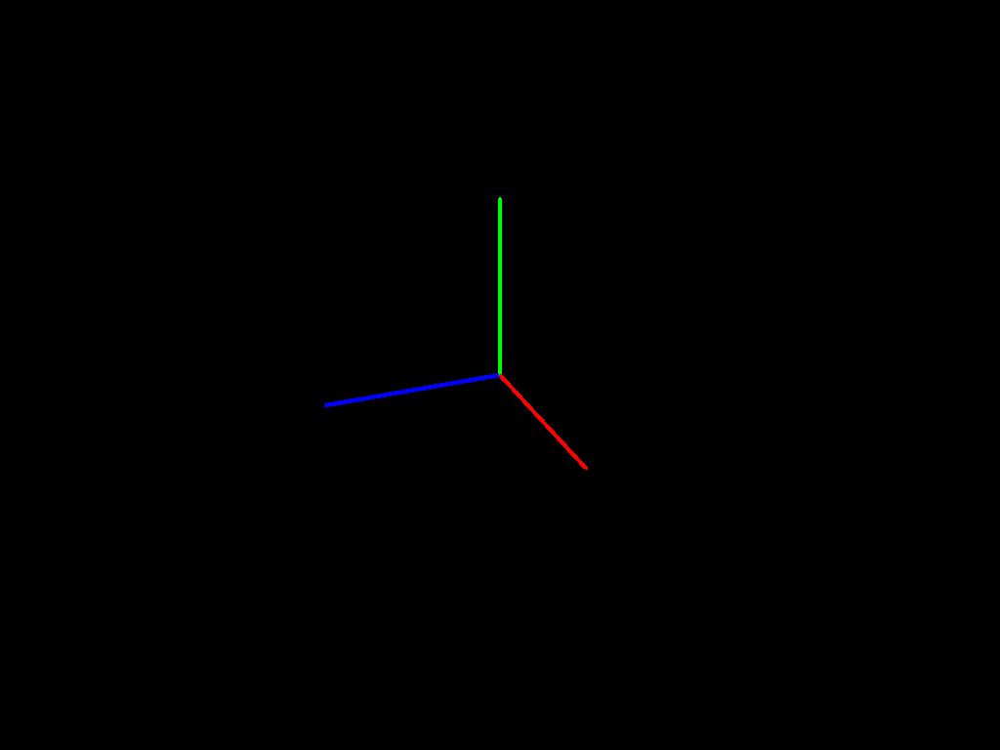
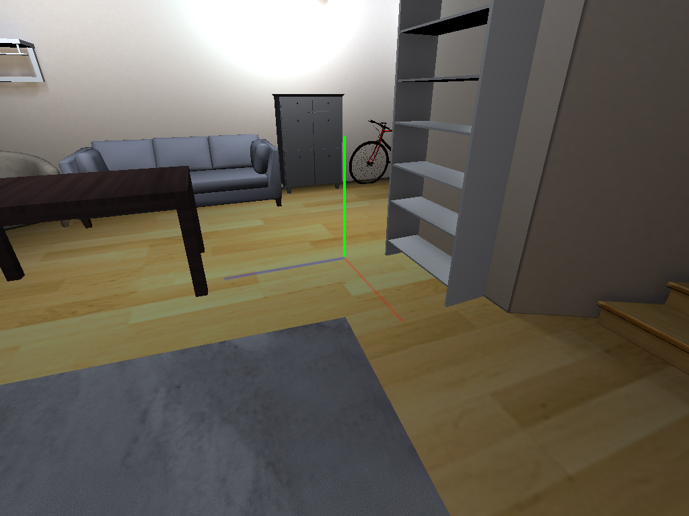
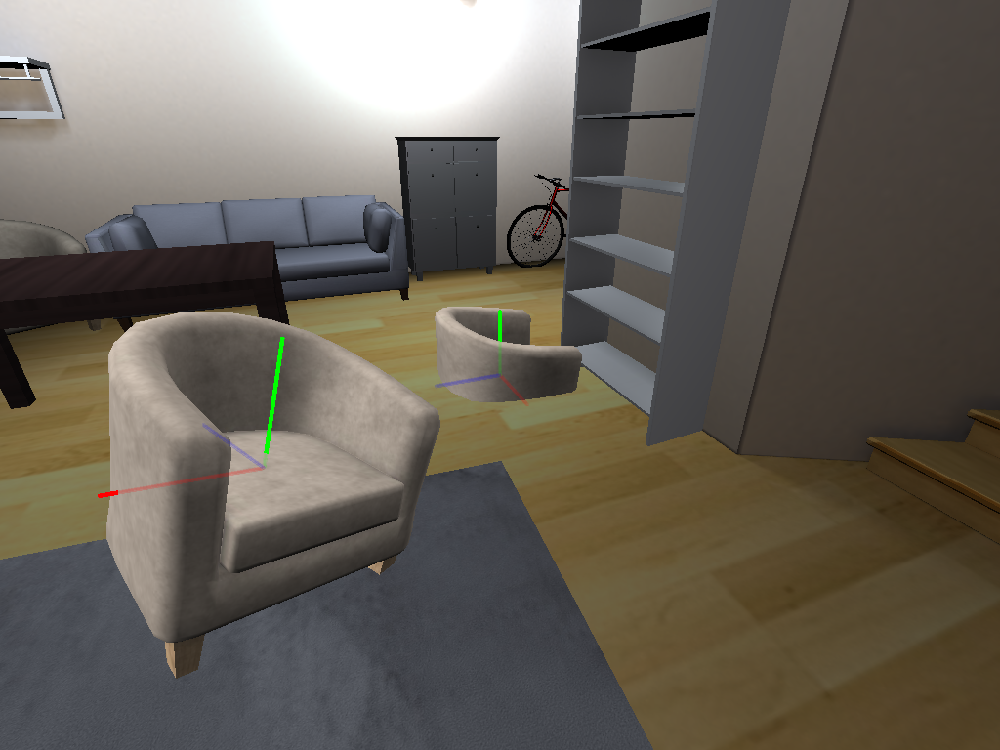
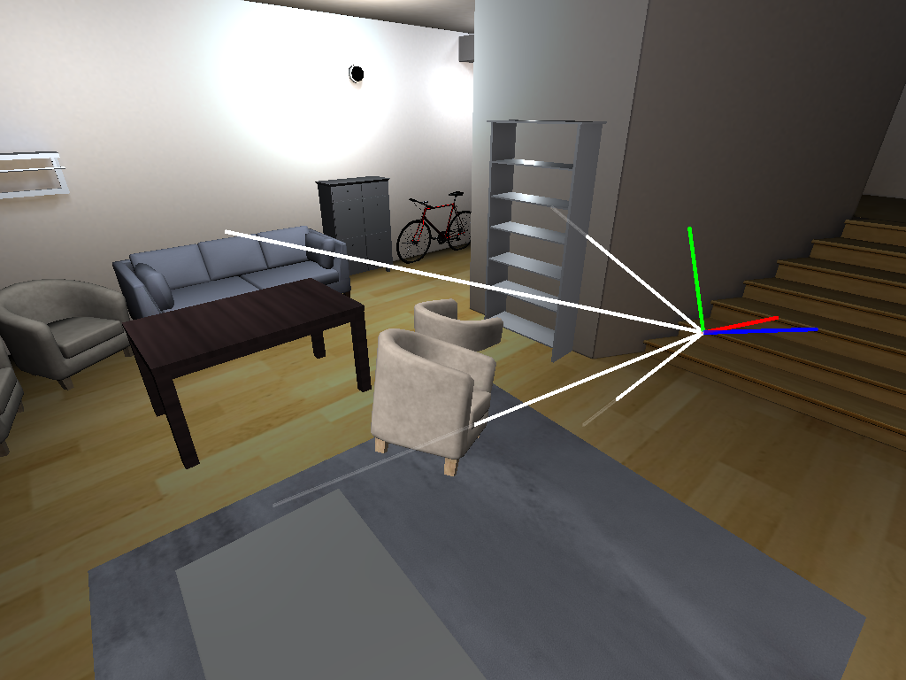
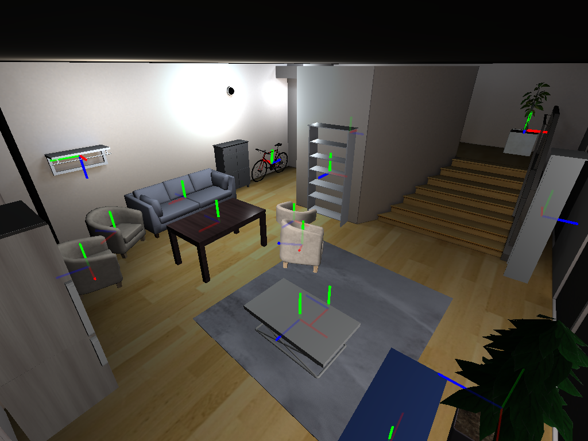
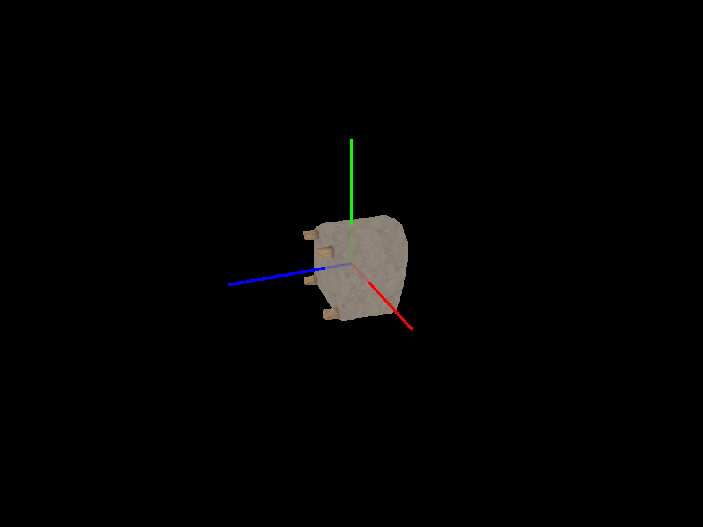
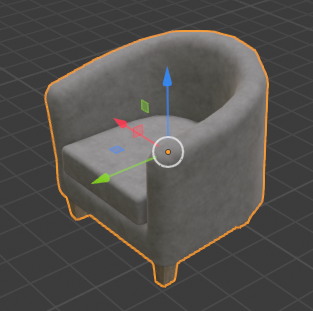

Coordinate Frame Tutorial
#########################

:summary: A review of coordinate frame conventions in Habitat.

.. contents::
    :class: m-block m-default

The example code below is available on `Colab <https://colab.research.google.com/github/facebookresearch/habitat-sim/blob/main/examples/tutorials/colabs/coordinate_frame_tutorial.ipynb>`_, or runnable via:

.. code:: shell-session

    $ python path/to/habitat-sim/examples/tutorials/nb_python/coordinate_frame_tutorial.py

`Setup`_
========

Import necessary modules:

.. include:: ../../examples/tutorials/nb_python/coordinate_frame_tutorial.py
    :code: py
    :start-after: # [imports]
    :end-before: # [/imports]

Define constants and globals:

.. include:: ../../examples/tutorials/nb_python/coordinate_frame_tutorial.py
    :code: py
    :start-after: # [setup]
    :end-before: # [/setup]

Define utility functions:

.. include:: ../../examples/tutorials/nb_python/coordinate_frame_tutorial.py
    :code: py
    :start-after: # [utils]
    :end-before: # [/utils]

`Examples`_
===========

Coordinate frame conventions: y-up and right-handed
***************************************************

Create a sim with an empty scene. Draw the world axes at the origin, with colors x+ = red, y+ = green, z+ = blue.
Note conventions: y-up (green vector) and `right-handed <https://en.wikipedia.org/wiki/Right-hand_rule>`_.

.. include:: ../../examples/tutorials/nb_python/coordinate_frame_tutorial.py
    :code: py
    :start-after: # [empty_scene_coord_frame]
    :end-before: # [/empty_scene_coord_frame]

Loading a ReplicaCAD scene
**************************

.. include:: ../../examples/tutorials/nb_python/coordinate_frame_tutorial.py
    :code: py
    :start-after: # [replica_cad_scene_coord_frame]
    :end-before: # [/replica_cad_scene_coord_frame]

A rigid object's local coordinate frame
***************************************

Add two chairs in different poses. The local origin is roughly at the center of mass. The local up axis is y+ (green vector)
and the local forward axis is z- (negation of blue z+ vector). These conventions depends on how the object model is authored.
ReplicaCAD object models follow these conventions, but models from other datasets may differ.

.. include:: ../../examples/tutorials/nb_python/coordinate_frame_tutorial.py
    :code: py
    :start-after: # [rigid_object_coord_frame]
    :end-before: # [/rigid_object_coord_frame]

Camera coordinate frame
***********************

Let's look more closely at the transform of the camera used for the previous image.
The camera's local axes are similar to the chair: right = red = x+, up = green = y+, forward (into the scene) = z- (negation of blue z+ vector).

.. include:: ../../examples/tutorials/nb_python/coordinate_frame_tutorial.py
    :code: py
    :start-after: # [camera_coord_frame]
    :end-before: # [/camera_coord_frame]

More object coordinate frames
*****************************

Let's show the local origins and axes of all rigid objects in the scene.

.. include:: ../../examples/tutorials/nb_python/coordinate_frame_tutorial.py
    :code: py
    :start-after: # [more_objects_coord_frame]
    :end-before: # [/more_objects_coord_frame]

Loading a GLB as a scene
************************

Let's re-create the sim and load a chair GLB as a scene. Beware, this is an example of what *not* to do!
This is a legacy codepath to support loading GLB scenes from the MP3D dataset (not shown here).
One quirk of this legacy codepath is that it rotates the model 90 degrees!

.. include:: ../../examples/tutorials/nb_python/coordinate_frame_tutorial.py
    :code: py
    :start-after: # [glb_scene_coord_frame]
    :end-before: # [/glb_scene_coord_frame]

Blender conventions and sources of confusion
********************************************

Blender is an open-source 3D-modeling tool that we on the Habitat team often use. We describe two caveats here:

#. Its convention is z-up, e.g. the default 3D camera is oriented such that z is up.
#. Blender automatically rotates gltf/glb models on import (essentially making the assumption that they were authored as y-up). It also reverses this rotation on export (see `+Y Up` gltf exporter option; enabled by default). The rotation is 90 degrees about the local x axis.

Here, we've imported `frl_apartment_chair_01.glb` and taken a screenshot.
Note the axes with the same colors used elsewhere in this tutorial: red = x+, green = y+, and blue = z+.
Compare this image to the section above, `A rigid object's local coordinate frame`.
The local axes are different, but the chair still appears upright.

