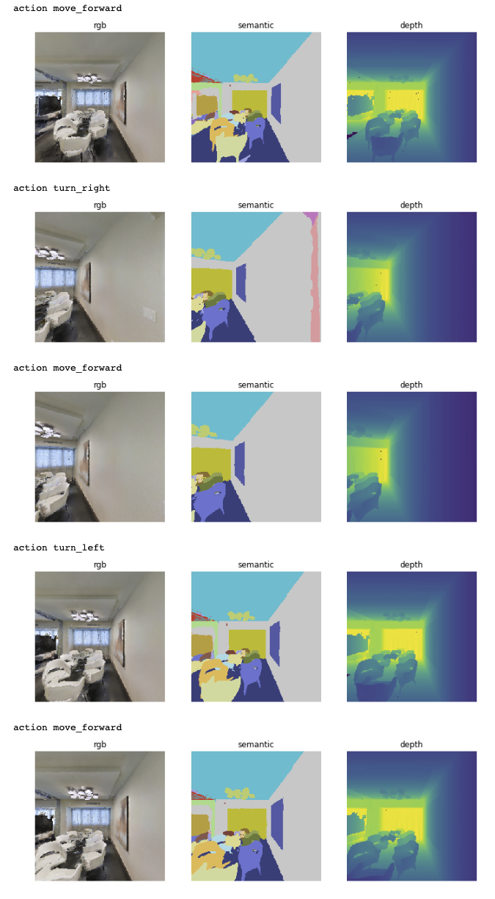

Habitat Sim Quickstart
##################################################

:ref-prefix:
    habitat_sim.simulator
    habitat_sim.sim
    habitat_sim.agent
    habitat_sim.scene

:summary: This is a quick-start guide to Habitat-sim -- loading a scene (including semantic annotations), defining an agent, stepping in the scene via random (navigation) actions, and rendering sensor observations.

.. contents::
    :class: m-block m-default

The example code below is available as an `ipython notebook`_, or runnable via:

.. _Collab: <https://github.com/facebookresearch/habitat-sim/tree/main/examples/tutorials/colabs/habitat-sim-quickstart.ipynb>

.. code:: shell-session

    $ python path/to/habitat-sim/examples/tutorials/nb_python/habitat-sim-quickstart.py

First, download the MP3D example scene used in this tutorial:

.. code:: shell-session

    $ python -m habitat_sim.utils.datasets_download --uids mp3d_example_scene --data-path path/to/data/

Now, put this path in the code:

.. include:: ../../examples/tutorials/nb_python/habitat-sim-quickstart.py
    :code: py
    :start-after: # [setup]
    :end-before: # [/setup]

`Simulator Config`_
========================

Now, let's define the sensors and actions for our agent, and initialize the :ref:`Simulator`.

.. include:: ../../examples/tutorials/nb_python/habitat-sim-quickstart.py
    :code: py
    :start-after: # [initialize]
    :end-before: # [/initialize]

`Scene semantic annotations`_
========================
Let's print some statistics about the semantic annotations in this scene.

.. include:: ../../examples/tutorials/nb_python/habitat-sim-quickstart.py
    :code: py
    :start-after: # [semantics]
    :end-before: # [/semantics]

.. code:: shell-session

    House has 1 levels, 10 regions and 187 objects
    House center:[-2.7928104  1.3372791 -1.5051247] dims:[17.57338    2.9023619  8.8595495]
    Level id:0, center:[-3.1573648  1.33728   -1.5051247], dims:[16.69967    2.90236    8.8595495]
    Region id:0_0, category:bedroom, center:[-8.821845   1.2594094 -2.691538 ], dims:[4.163309  2.5356622 4.2073426]
    Object id:0_0_0, category:wall, center:[-8.86568    1.2817702 -2.73879  ], dims:[4.5891   2.581481 4.591819]
    Object id:0_0_1, category:ceiling, center:[-8.91329  2.20326 -2.80575], dims:[4.4761996 0.7124367 4.460079 ]
    Object id:0_0_2, category:misc, center:[-8.69572    1.1633401 -4.2134695], dims:[2.5021195  2.3407402  0.61950994]
    Object id:0_0_3, category:curtain, center:[-10.9129      1.0454602  -2.9228697], dims:[0.49171448 2.13486    3.8549194 ]
    Object id:0_0_4, category:void, center:[-8.06444    1.4491597 -1.7219999], dims:[0.6184306 1.5347226 0.8975539]
    Object id:0_0_5, category:bed, center:[-8.71032    0.6567161 -2.7839994], dims:[2.0257607 1.2672682 2.45652  ]
    Object id:0_0_6, category:void, center:[-6.79918  1.40336 -1.91666], dims:[0.2847662  0.8195841  0.08472037]
    Object id:0_0_7, category:tv_monitor, center:[-10.9803    1.01896  -1.43764], dims:[0.93102264 0.674376   1.2230382 ]
    Object id:0_0_9, category:chest_of_drawers, center:[-9.89281     0.31491923 -3.5474799 ], dims:[0.57509613 0.63675594 0.47650623]
    Object id:0_0_10, category:cushion, center:[-9.2041     0.5827892 -3.71507  ], dims:[1.0096397  0.90284204 0.31469202]

`Agent Initialization`_
========================

Let's initialize an agent in the scene at a scecific location, and verify that it is indeed at that location

.. include:: ../../examples/tutorials/nb_python/habitat-sim-quickstart.py
    :code: py
    :start-after: # [agent]
    :end-before: # [/agent]

.. code:: shell-session

    agent_state: position [0.       0.072447 0.      ] rotation quaternion(1, 0, 0, 0)

`Visualization Helper Function`_
========================

Let's define a convenient helper to visualize the agent's RGB, depth, and semantic sensor observations.

.. include:: ../../examples/tutorials/nb_python/habitat-sim-quickstart.py
    :code: py
    :start-after: # [vis_helper]
    :end-before: # [/vis_helper]

`Random Actions`_
========================

Finally, let's have the agent take random actions and let's visualize its observations along the path.

.. include:: ../../examples/tutorials/nb_python/habitat-sim-quickstart.py
    :code: py
    :start-after: # [random_actions]
    :end-before: # [/random_actions]

