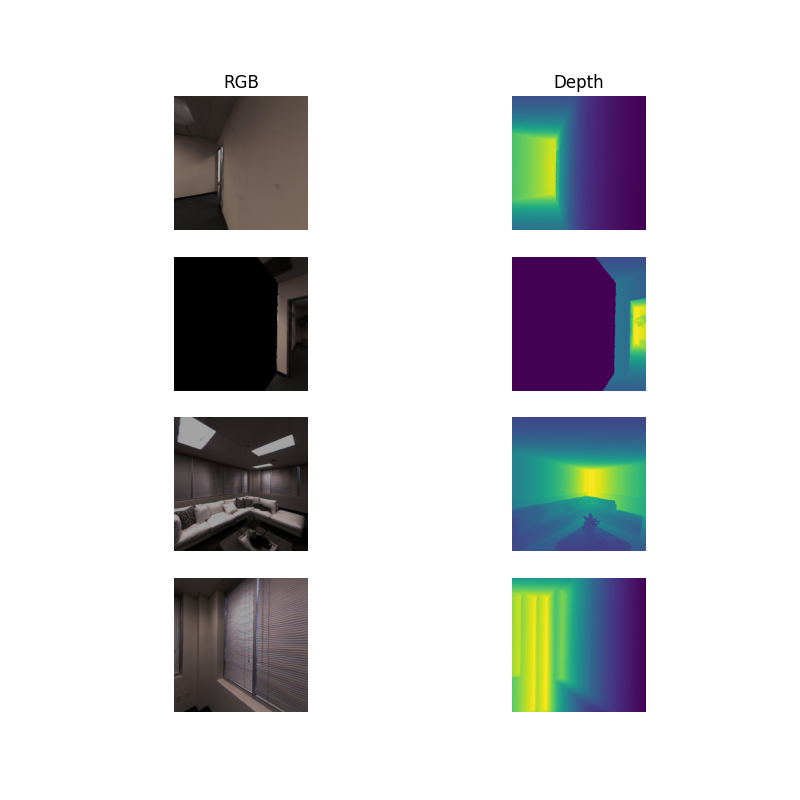
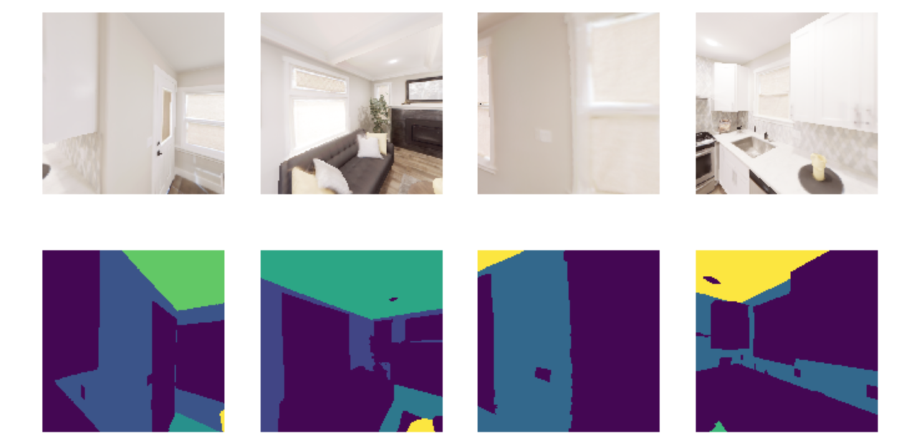
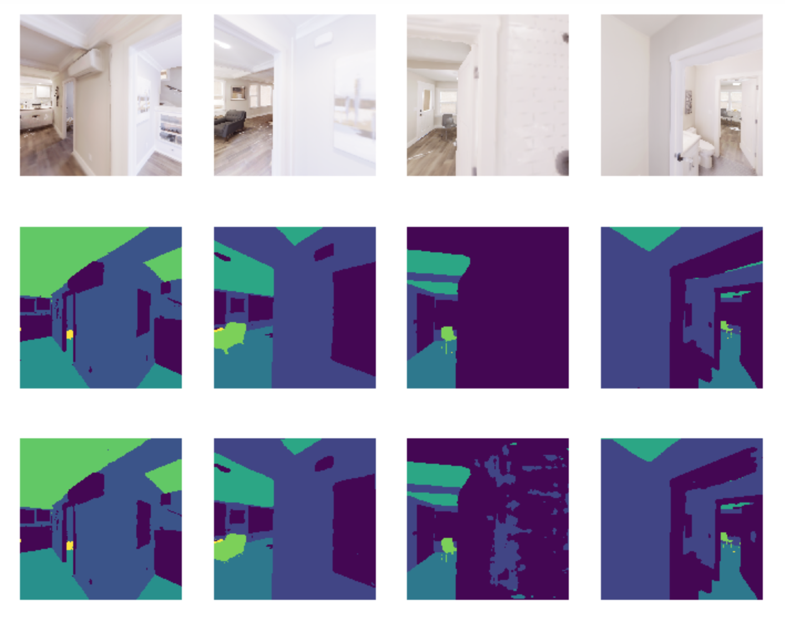
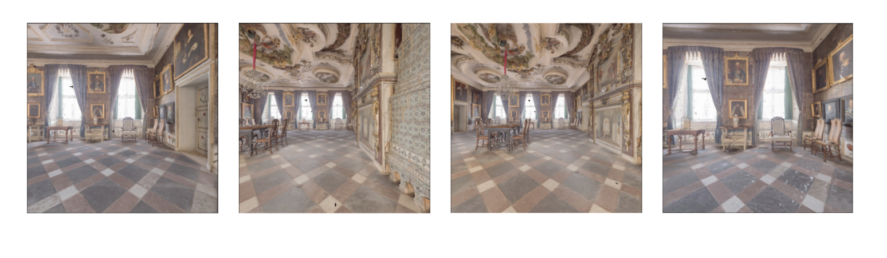

Habitat Sim Image Extractor Tutorial
####################################

:summary: This tutorial will demonstrate how to use the Image Extraction API in Habitat Sim and the different user options available.

.. contents::
    :class: m-block m-default

In this tutorial we will learn how to use the image extraction API in Habitat Sim by working through an example use case - training a semantic segmentation model on images and segmentation ground-truth extracted from environments loaded into Habitat Sim. The tutorial will be structured as follows.

We will first provide an overview of how to use the image extraction API. Next we will show how to use the API to train a semantic segmentation model. Finally, we will show how to define a custom pose extraction method, which is how a user programmatically defines the camera poses for image extraction.

`Overview of Image Extraction`_
===============================

Habitat Sim provides an API to extract static images from a scene. The main class that handles image data extraction in Habitat Sim is called ImageExtractor. The user only needs to provide the scene filepath (either a .glb or .ply file).

``class ImageExtractor(scene_filepath, img_size, output, pose_extractor_name, shuffle, split, use_caching, pixels_per_meter)``

**Args**

* scene_filepath (required): A string or list of strings that is the filepath(s) to the scene file(s).
* img_size: A tuple of (height, width) that represent the desired output image size. Default (512, 512).
* output: A list of output images types. Options include any combination of ["rgba", "depth", "semantic"]. Default ["rgba"].
* pose_extractor_name: The name of the pose extractor used to programmatically define camera poses for image extraction. If the user registered a custom pose extractor (see "Custom Pose Extraction" section), this is the name given during registration. Default "closest_point_extractor".
* shuffle: Whether to shuffle the extracted images once they have been extracted. Default True.
* split: A tuple of train/test split percentages. Must add to 100. Default (70, 30).
* use_chaching: If True, ImageExtractor caches images in memory for quicker access during training. Default True.
* pixels_per_meter: Resolution of topdown map (explained below). 0.1 means each pixel in the topdown map represents 0.1 x 0.1 meters in the coordinate system of the scene. Default 0.1.

**Methods**

``__len__() -> int``:

Returns the number of images in the extractor for a certain mode (see the set_mode method). For example, if the extractor is in 'train' mode, this method will return the number of train images. If the extractor is in 'full' mode, which is the default, it will return the total number of images (test + train).

-----

``__getitem__(idx) -> dict``:

Returns the a dictionary whose keys are specified by the 'output' argument of the constructor and whose values are the corresponding image. E.g. {'rgba': <a color image>}. Supports slicing.

* idx (int or slice): The index or slice of the desired output

-----

``set_mode(mode) -> None``:

Sets the mode of the extractor, which determines which outputs it returns. The default mode is 'full', meaning the extractor will use the full range of outputs it has extracted. For example, if the extractor is set to 'train' mode, subsequent indexing into the extractor will index from the list of train outputs.

* mode (str): The mode to set the extractor to. Options are 'full', 'train', or 'test'.

-----

``get_semantic_class_names() -> List[str]``:

Returns a list of the names of all the semantic classes represented in the current scene, assuming the scene supports semantic labels (some scenes do not have semantic meshes, and therefore the output of this will be an empty list).

-----

``close() -> None``:

The ImageExtractor uses an instance of habitat_sim.Simulator on the backend to extract images, of which only one can be instantiated at a time. Therefore, if you try to instantiate two ImageExtractors, you will get an error. You must call this method before instantiating another ImageExtractor. This method deletes the simulator associated with the current ImageExtracor instance.

-----

`Basic Usage`_
--------------

Once the user instantiates an ImageExtractor object, they can index into it like a normal python list, or use slicing. Indexing returns a dictionary containing the images specified by the 'output' argument to the ImageExtractor constructor.

.. code:: py

    import numpy as np
    import matplotlib.pyplot as plt

    from habitat_sim.utils.data import ImageExtractor

    # For viewing the extractor output
    def display_sample(sample):
        img = sample["rgba"]
        depth = sample["depth"]
        semantic = sample["semantic"]

        arr = [img, depth, semantic]
        titles = ["rgba", "depth", "semantic"]
        plt.figure(figsize=(12, 8))
        for i, data in enumerate(arr):
            ax = plt.subplot(1, 3, i + 1)
            ax.axis("off")
            ax.set_title(titles[i])
            plt.imshow(data)

        plt.show()

    scene_filepath = "data/scene_datasets/habitat-test-scenes/apartment_1.glb"

    extractor = ImageExtractor(
        scene_filepath,
        img_size=(512, 512),
        output=["rgba", "depth", "semantic"],
    )

    # Use the list of train outputs instead of the default, which is the full list
    # of outputs (test + train)
    extractor.set_mode('train')

    # Index in to the extractor like a normal python list
    sample = extractor[0]

    # Or use slicing
    samples = extractor[1:4]
    for sample in samples:
        display_sample(sample)

    # Close the extractor so we can instantiate another one later
    # (see close method for detailed explanation)
    extractor.close()

`Example Use Case: Semantic Segmentation`_
==========================================

To familiarize ourselves with using image extraction in Habitat, we will train a semantic segmentation model to overfit on a small amount of data extracted from the `Replica dataset`_. We will integrate the image extractor with a `Pytorch Dataset and Dataloader`_, which allows us to easily batch data for training.

`Setup`_
--------

Make sure you have Habitat Sim correctly installed and the data downloaded (see the `installation instructions`_ for details). First, let's define some helpful variables and create our Pytorch Dataset subclass which defines our training examples. Since an ImageExtractor returns numpy ndarrays for the rgba and semantic images, we will convert these into Pytorch tensors by passing a `transform`_ to our SemanticSegmentationDataset class so it can be used on each extracted image.

.. code:: py

    import numpy as np
    import matplotlib.pyplot as plt

    import torch
    from torch.utils.data import DataLoader, Dataset
    from torchvision import utils
    from torchvision.transforms import ToTensor

    from habitat_sim.utils.data import ImageExtractor

    # Replace with the path to your scene file
    SCENE_FILEPATH = 'data/scene_datasets/habitat-test-scenes/apartment_0/mesh.ply'
    BATCH_SIZE = 4

    class SemanticSegmentationDataset(Dataset):
        def __init__(self, extractor, transforms=None):
            # Define an ImageExtractor
            self.extractor = extractor

            # We will perform preprocessing transforms on the data
            self.transforms = transforms

            # Habitat sim outputs instance id's from the semantic sensor (i.e. two
            # different chairs will be marked with different id's). So we need
            # to create a mapping from these instance id to the class labels we
            # want to predict. We will use the below dictionaries to define a
            # funtion that takes the raw output of the semantic sensor and creates
            # a 2d numpy array of out class labels.
            self.labels = {
                'background': 0,
                'wall': 1,
                'floor': 2,
                'ceiling': 3,
                'chair': 4,
                'table': 5,
            }
            self.instance_id_to_name = self.extractor.instance_id_to_name
            self.map_to_class_labels = np.vectorize(
                lambda x: self.labels.get(self.instance_id_to_name.get(x, 0), 0)
            )

        def __len__(self):
            return len(self.extractor)

        def __getitem__(self, idx):
            sample = self.extractor[idx]
            raw_semantic_output = sample['semantic']
            truth_mask = self.get_class_labels(raw_semantic_output)

            output = {
                'rgb': sample['rgba'][:, :, :3],
                'truth': truth_mask.astype(int),
            }

            if self.transforms:
                output['rgb'] = self.transforms(output['rgb'])
                output['truth'] = self.transforms(output['truth']).squeeze(0)

            return output

        def get_class_labels(self, raw_semantic_output):
            return self.map_to_class_labels(raw_semantic_output)

    extractor = ImageExtractor(SCENE_FILEPATH, output=['rgba', 'semantic'])

    dataset = SemanticSegmentationDataset(extractor,
        transforms=transforms.Compose([transforms.ToTensor()])
    )

    # Create a Dataloader to batch and shuffle our data
    dataloader = DataLoader(dataset, batch_size=BATCH_SIZE, shuffle=True)

Now let's view some of the data to make sure it looks good.

.. code:: py

    def show_batch(sample_batch):
        def show_row(imgs, batch_size, img_type):
            plt.figure(figsize=(12, 8))
            for i, img in enumerate(imgs):
                ax = plt.subplot(1, batch_size, i + 1)
                ax.axis("off")
                if img_type == 'rgb':
                    plt.imshow(img.numpy().transpose(1, 2, 0))
                elif img_type == 'truth':
                    plt.imshow(img.numpy())

            plt.show()

        batch_size = len(sample_batch['rgb'])
        for k in sample_batch.keys():
            show_row(sample_batch[k], batch_size, k)

    _, sample_batch = next(enumerate(dataloader))
    show_batch(sample_batch)

Now that we can extract and view data using the ImageExtractor, let's define our model. A popular model for semantic segmentation is `UNET`_, originally developed by Olaf Ronneberger et al. for medical image segmentation. This implementation of UNET was taken from `this github repo`_.

.. code:: py

    import torch.nn as nn
    import torch.nn.functional as F

    class DoubleConv(nn.Module):
        """(convolution => [BN] => ReLU) * 2"""

        def __init__(self, in_channels, out_channels, mid_channels=None):
            super().__init__()
            if not mid_channels:
                mid_channels = out_channels
            self.double_conv = nn.Sequential(
                nn.Conv2d(in_channels, mid_channels, kernel_size=3, padding=1),
                nn.BatchNorm2d(mid_channels),
                nn.ReLU(inplace=True),
                nn.Conv2d(mid_channels, out_channels, kernel_size=3, padding=1),
                nn.BatchNorm2d(out_channels),
                nn.ReLU(inplace=True)
            )

        def forward(self, x):
            return self.double_conv(x)

    class Down(nn.Module):
        """Downscaling with maxpool then double conv"""

        def __init__(self, in_channels, out_channels):
            super().__init__()
            self.maxpool_conv = nn.Sequential(
                nn.MaxPool2d(2),
                DoubleConv(in_channels, out_channels)
            )

        def forward(self, x):
            return self.maxpool_conv(x)

    class Up(nn.Module):
        """Upscaling then double conv"""

        def __init__(self, in_channels, out_channels, bilinear=True):
            super().__init__()

            # if bilinear, use the normal convolutions to reduce the number of channels
            if bilinear:
                self.up = nn.Upsample(scale_factor=2, mode='bilinear', align_corners=True)
                self.conv = DoubleConv(in_channels, out_channels, in_channels // 2)
            else:
                self.up = nn.ConvTranspose2d(
                    in_channels , in_channels // 2,
                    kernel_size=2, stride=2
                )
                self.conv = DoubleConv(in_channels, out_channels)

        def forward(self, x1, x2):
            x1 = self.up(x1)
            # input is CHW
            diffY = x2.size()[2] - x1.size()[2]
            diffX = x2.size()[3] - x1.size()[3]

            x1 = F.pad(x1, [diffX // 2, diffX - diffX // 2,
                            diffY // 2, diffY - diffY // 2])

            x = torch.cat([x2, x1], dim=1)
            return self.conv(x)

    class OutConv(nn.Module):
        def __init__(self, in_channels, out_channels):
            super(OutConv, self).__init__()
            self.conv = nn.Conv2d(in_channels, out_channels, kernel_size=1)

        def forward(self, x):
            return self.conv(x)

    class UNet(nn.Module):
        def __init__(self, n_channels, n_classes, bilinear=True):
            super(UNet, self).__init__()
            self.n_channels = n_channels
            self.n_classes = n_classes
            self.bilinear = bilinear

            self.inc = DoubleConv(n_channels, 64)
            self.down1 = Down(64, 128)
            self.down2 = Down(128, 256)
            self.down3 = Down(256, 512)
            factor = 2 if bilinear else 1
            self.down4 = Down(512, 1024 // factor)
            self.up1 = Up(1024, 512 // factor, bilinear)
            self.up2 = Up(512, 256 // factor, bilinear)
            self.up3 = Up(256, 128 // factor, bilinear)
            self.up4 = Up(128, 64, bilinear)
            self.outc = OutConv(64, n_classes)

        def forward(self, x):
            x1 = self.inc(x)
            x2 = self.down1(x1)
            x3 = self.down2(x2)
            x4 = self.down3(x3)
            x5 = self.down4(x4)
            x = self.up1(x5, x4)
            x = self.up2(x, x3)
            x = self.up3(x, x2)
            x = self.up4(x, x1)
            logits = self.outc(x)
            return logits

    # We have 3 input channels (rgb) and 6 classes we want to semantically segment
    model = UNet(n_channels=3, n_classes=6)

`Training`_
-----------

We have a model now - Great! For the loss function we'll use cross entropy because we are training a multi-class classification problem (i.e. classifying each pixel of the image). For the optimization algorithm, we've chosen `RMSprop`_.

.. code:: py

    from torch import optim

    num_epochs = 1000
    lr = 0.0001
    val_check = 5

    device = torch.device('cuda' if torch.cuda.is_available() else 'cpu')
    model.to(device)
    optimizer = optim.RMSprop(model.parameters(), lr=lr, weight_decay=1e-8, momentum=0.9)
    criterion = nn.CrossEntropyLoss()

    for epoch in range(num_epochs):
        epoch_loss = 0
        for batch in dataloader:
            imgs = batch['rgb']
            true_masks = batch['truth']

            # Move the images and truth masks to the proper device (cpu or gpu)
            imgs = imgs.to(device=device, dtype=torch.float32)
            true_masks = true_masks.to(device=device, dtype=torch.long)

            # Get the model prediction
            masks_pred = model(imgs)

            # Evaluate the loss, which is Cross-Entropy in our case
            loss = criterion(masks_pred, true_masks)
            epoch_loss += loss.item()

            # Update the model parameters
            optimizer.zero_grad()
            loss.backward()
            nn.utils.clip_grad_value_(model.parameters(), 0.1)
            optimizer.step()

        # Evaluate the model on validation set
        if epoch % val_check == 0:
            print(f"iter: {epoch}, train loss: {epoch_loss}")

`Results`_
----------

After training for a short time on a small training dataset, we are able to see some pretty good results, indicating that our model is learning the way we expect. We can visualize the output.

.. code:: py

    import torch.nn.functional as F

    def show_batch(sample_batch):
        def show_row(imgs, batch_size, img_type):
            plt.figure(figsize=(12, 8))
            for i, img in enumerate(imgs):
                ax = plt.subplot(1, batch_size, i + 1)
                ax.axis("off")
                if img_type == 'rgb':
                    plt.imshow(img.numpy().transpose(1, 2, 0))
                elif img_type in ['truth', 'prediction']:
                    plt.imshow(img.numpy())

            plt.show()

        batch_size = len(sample_batch['rgb'])
        for k in sample_batch.keys():
            show_row(sample_batch[k], batch_size, k)

    with torch.no_grad():
        model.to('cpu')
        model.eval()
        _, batch = next(enumerate(dataloader))
        mask_pred = model(batch['rgb'])
        mask_pred = F.softmax(mask_pred, dim=1)
        mask_pred = torch.argmax(mask_pred, dim=1)

        batch['prediction'] = mask_pred

        show_batch(batch)

On the top row we see the input to the model which is the batch of RGB images. On the middle row is the grouth truth masks. On the bottom row are the masks that the model predicted.

.. _Replica dataset: https://github.com/facebookresearch/Replica-Dataset
.. _Pytorch Dataset and Dataloader: https://pytorch.org/tutorials/beginner/data_loading_tutorial.html
.. _installation instructions: https://github.com/facebookresearch/habitat-sim
.. _transform: https://pytorch.org/docs/stable/torchvision/transforms.html
.. _UNET: https://arxiv.org/abs/1505.04597
.. _this github repo: https://github.com/milesial/Pytorch-UNet
.. _RMSprop: http://www.cs.toronto.edu/~tijmen/csc321/slides/lecture_slides_lec6.pdf

`Writing Custom Pose Extractors`_
=================================

Each instance of an ImageExtractor has a pose extractor (an instance of PoseExtractor). The pose extractor defines how camera poses are programmatically determined so that the image
extractor knows how to manipulate the camera position and angle to extract an image from habitat

Users can write their over subclass of PoseExtractor to define custom ways of getting these camera poses. All custom pose extractors must inherit from the PoseExtractor abstract class and
override the extract_poses method. Further, the user must register the pose extractor using
habitat_sim.registry (i.e. adding the @registry.register_pose_extractor(name) decorator). This allows you to pass the name of your custom pose extractor to the ImageExtractor constructor. For more detailed examples of using the Habitat registry, see `this code`_.

`Default Behavior`_
-------------------

The default behavior is reliant on something called the topdown view of a scene, which is just a two-dimensional birds-eye representation of the scene. The topdown view is a two-dimensional array of 1s and 0s where 1 means that pixel is "navigable" in the scene (i.e. an agent can walk on top of that point) and 0 means that pixel is "unnavigable". For more detailed information about navigability and computing topdown maps, please refer to the `Habitat-Sim Basics for Navigation Colab notebook`_.

The default pose extractor is the ClosestPointExtractor, which behaves as follows. For each camera poisition, the pose extractor will aim the camera pose at the closest point that is "unnvaigable". For example, if the camera position is right next to a chair in the scene, and that chair is the closest point that an agent in the environment cannot walk on top of, the camera will point at the chair.

The ClosestPointExtractor will use the topdown view of the scene, which is given to it in its constructor, and create a grid of evenly spaced points. Each of those points will then yield a closest point as described above, which is used to define a camera angle, and subsequently a camera pose.

.. image:: ../images/apt0-topdown.png

With this method, the total number of images extracted is low compared to the PanoramaExtractor, which is another type of extractor we provide. The PanoramaExtractor has no notion of closest point, rather it extracts multiple camera poses from each camera position by turning all the way around.

`Overriding required methods`_
------------------------------

You should not override the init method in your custom pose extractor, but if you need to you must take in two required arguments, which are the topdownview(s) and the pixels_per_meter, and pass them to the constructor of PoseExtractor superclass using ``super().__init__(topdownviews, pixels_per_meter)``. This is because the ImageExtractor will pass your pose extractor these arguments which the PoseExtractor superclass will use to convert between the coordinate system of those topdown views and the scene coordinate system.

You must override the extract_poses method which takes two required arguments:

* view (numpy.ndarray): A 2 dimensional array representing the topdown view of a scene. This array is used to determine valid camera positions. 1.0 in the array means the position is valid and 0.0 means the position is not valid.
* fp (str): The filepath of the scene that the view represents.

The job of the extract_poses method is to return a list of poses where each pose is a three-tuple
of (<camera position>, <point of interest>, <scene filepath>). The camera position is the
coordinates of the camera in the space of the topdown view. The point of interest is the position where
the camera will be pointing in the space of the topdown view. The filepath is the scene filepath the pose comes from, which is necessary when the ImageExtractor is querying images from multiple different scenes. Below
is an example of a pose extractor that simply chooses some random navigable points and looks forward.

.. code:: py

    import numpy as np
    import habitat_sim.registry as registry

    from habitat_sim.utils.data import ImageExtractor, PoseExtractor

    @registry.register_pose_extractor(name="random_pose_extractor")
    class RandomPoseExtractor(PoseExtractor):
        def extract_poses(self, view, fp):
            height, width = view.shape
            num_random_points = 4
            points = []
            while len(points) < num_random_points:
                # Get the row and column of a random point on the topdown view
                row, col = np.random.randint(0, height), np.random.randint(0, width)

                # Convenient method in the PoseExtractor class to check if a point
                # is navigable
                if self._valid_point(row, col, view):
                    points.append((row, col))

            poses = []

            # Now we need to define a "point of interest" which is the point the camera will
            # look at. These two points together define a camera position and angle
            for point in points:
                r, c = point
                point_of_interest = (r - 1, c) # Just look forward
                pose = (point, point_of_interest, fp)
                poses.append(pose)

            return poses

    scene_filepath = "data/scene_datasets/habitat-test-scenes/skokloster-castle.glb"
    extractor = ImageExtractor(
        scene_filepath,
        pose_extractor_name="random_pose_extractor"
    )

In the above code, we registered a new pose extractor with Habitat Sim and then used the name of
the new pose extractor in the ImageExtractor constructor.

NOTE: If you want to adjust the tilt of the camera (i.e. looking more toward the ground or the ceiling instead of straight ahead), you will need to modify the "_convert_to_scene_coordinate_system" method inside the PoseExtractor class. Specifically, in the computation of the rotation for the camera angle. Instead of calling "_compute_quat" to determine the camera angle, you can implement new logic.

.. code:: bash

    ...
    cam_normal = new_cpi - new_pos
    new_rot = self._compute_quat(cam_normal)
    poses[i] = (new_pos, new_rot, filepath)
    return poses

`Appendix`_
===========

This section will cover how image extraction is actually done when a user creates an ImageExtractor. When an ImageExtractor is instantiated, the following sequence of
events happen:

1. A Simulator class is created

.. code:: py

    sim_provided = sim is not None
    if not sim_provided:
        sim = habitat_sim.Simulator(self.cfg)
    else:
        # If a sim is provided we have to make a new cfg
        self.cfg = self._config_sim(sim.config.sim_cfg.scene_id, img_size)
        sim.reconfigure(self.cfg)

2. A towndown view of the scene is created, which a 2d numpy array consisting of 0.0s (meaning the point is unnavigable) and 1.0s (meaning the point is navigable). We create a list of 3-tuples (<topdown view>, <scene filepath>, <reference point for the scene>), one for each scene. This allows us to switch between multiple scenes and have a coordinate reference point within each scene.

.. code:: py

    self.tdv_fp_ref_triples = self._preprocessing(
        self.sim, self.scene_filepaths, self.pixels_per_meter
    )

3. Using the topdown view, the pose extractor extracts the camera poses that will be used for extracting images upon request (i.e. indexing) from the user.

.. code:: py

    self.pose_extractor = make_pose_extractor(pose_extractor_name)(*args)
    self.poses = self.pose_extractor.extract_all_poses()

4. The PoseExtractor returns a list of poses, where each pose contains (position, rotation, filepath) information. When it comes time for the ImageExtractor to return an image to the user, these poses are used to set the agent state within the simulator.

Thank you for reading!

.. _this code: https://github.com/facebookresearch/habitat-sim/blob/master/habitat_sim/utils/data/pose_extractor.py

.. _Habitat-Sim Basics for Navigation Colab notebook: https://colab.research.google.com/github/facebookresearch/habitat-sim/blob/master/examples/tutorials/colabs/ECCV_2020_Navigation.ipynb
