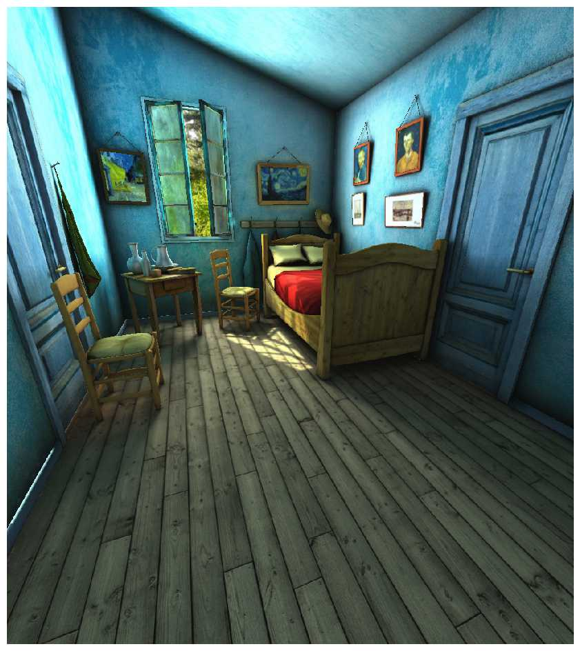
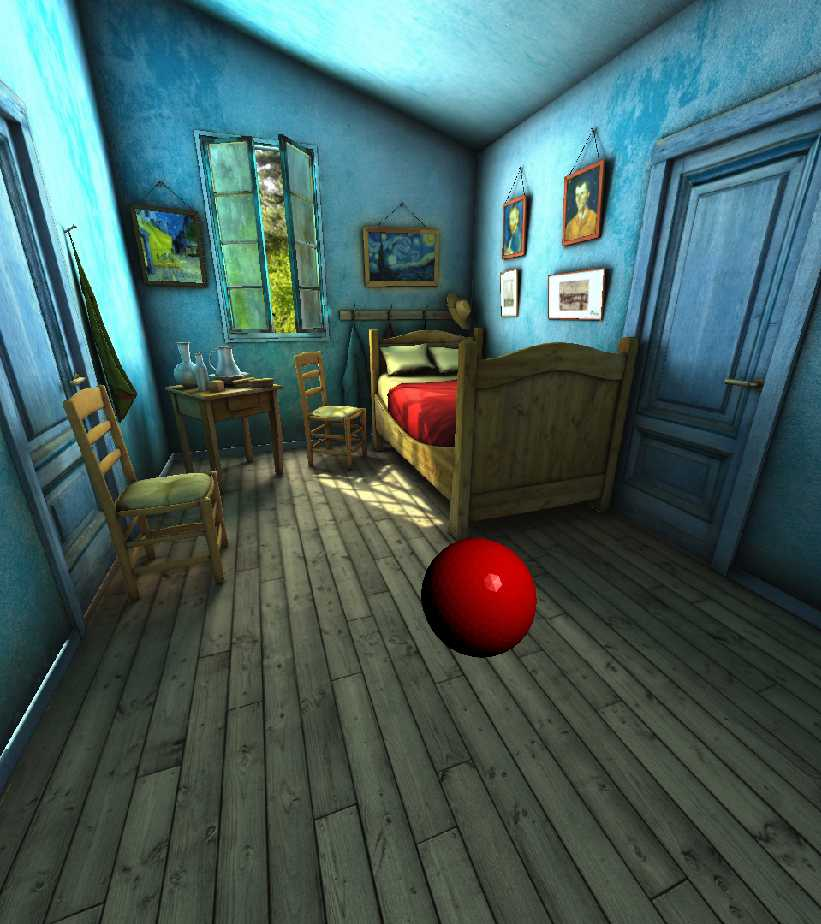
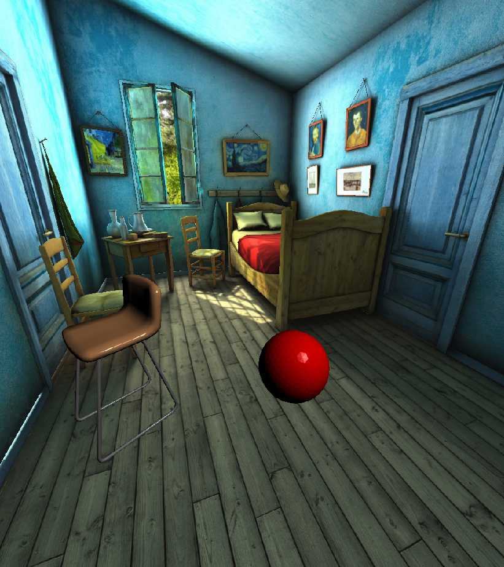
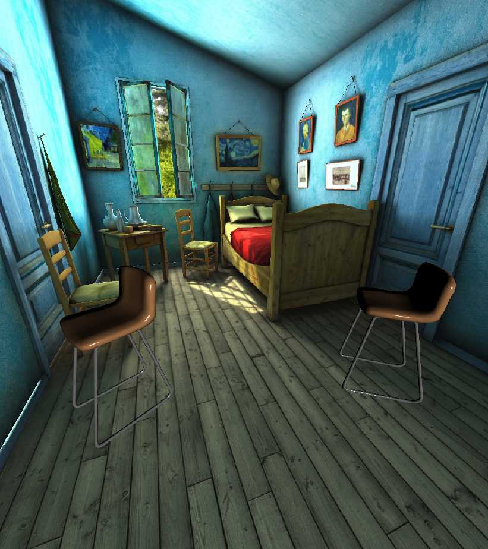
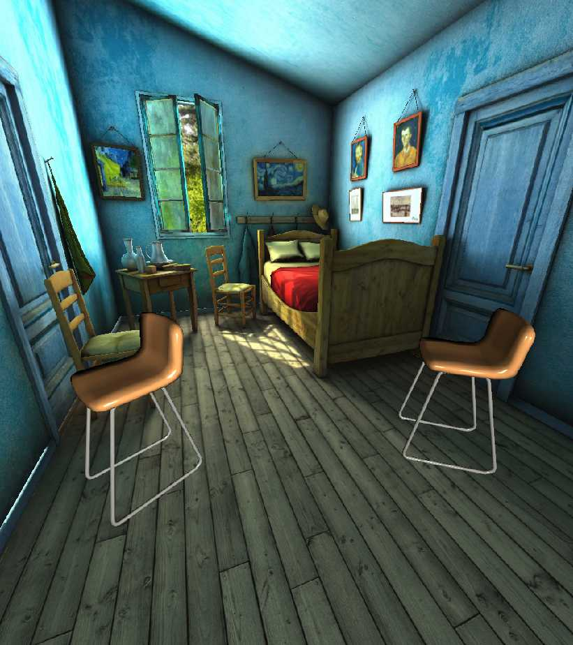
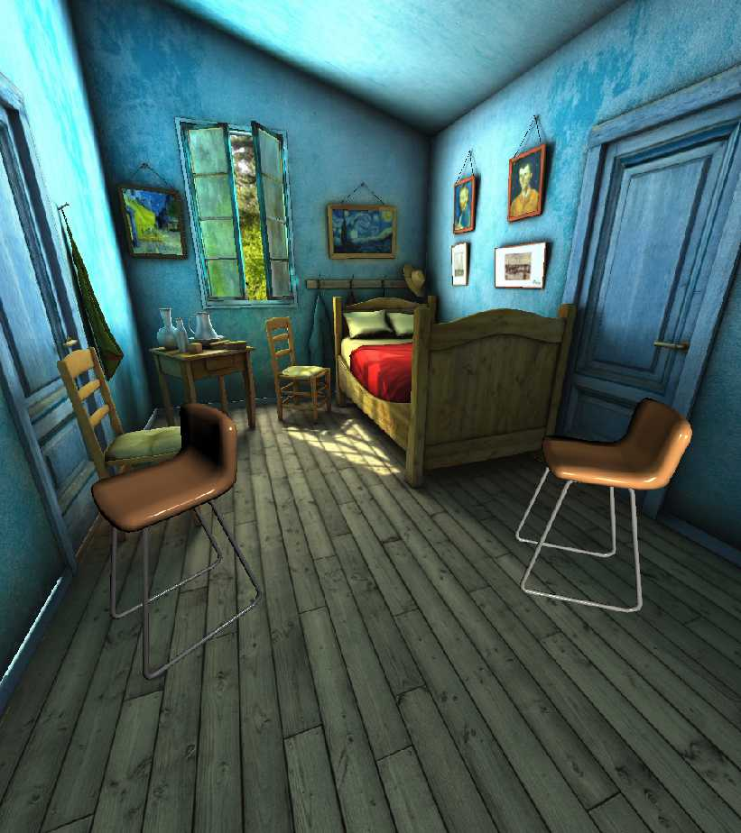

Working with Lights
###################

:ref-prefix:
    habitat_sim.gfx
    habitat_sim.simulator
    habitat_sim.sim
    habitat_sim.agent
    habitat_sim.attributes

:summary: This tutorial demonstrates lighting of scenes and objects in Habitat -- creation, placement, configuration, and manipulation of light sources and shaders.

.. contents::
    :class: m-block m-default

The example code below is runnable via:

.. code:: shell-session

    $ python examples/tutorials/lighting_tutorial.py

First, import necessary modules, define some convenience functions, and initialize the :ref:`Simulator` and :ref:`Agent`.

.. include:: ../../examples/tutorials/lighting_tutorial.py
    :code: py
    :start-after: # [setup]
    :end-before: # [/setup]

`Scene Lighting`_
=================

By default, the scene will be shaded with no lights using the :ref:`NO_LIGHT_KEY` default lighting setup.
This configuration is ideal for scene assets with illumination baked into textures (e.g. building scans such as MP3D).

.. include:: ../../examples/tutorials/lighting_tutorial.py
    :code: py
    :start-after: # [default scene lighting]
    :end-before: # [scene swap shader]

To use a custom light setup for the scene, edit the :ref:`SimulatorConfiguration.scene_light_setup`
option when creating/reconfiguring the Simulator. This option is ideal for scenes without illuminated textures, to create a custom tailored lighting configuration for the scene, or for domain randomization.
The second example below demonstrates a custom low-light setup for the room with a point light source originating at the window. A "0" in the 4-th entry of the `vector` parameter indicates that this is a point lights source position. Alternatively, a "1" in this entry would indicate a directional light source with no position and `vector` direction.

Note that while the scene's light setup can be modified dynamically during runtime, the :ref:`Simulator` will need to
be reconfigured to switch the scene's light setup key. Also, due to asset loading specifics
the :ref:`Simulator` **must be closed and re-initialize to swap between Flat and PBR (or Phong) shading setups**.

.. include:: ../../examples/tutorials/lighting_tutorial.py
    :code: py
    :start-after: # [scene swap shader]
    :end-before: # [/scene]

.. container:: m-row

    .. container:: m-col-m-5 m-push-m-1 m-col-s-6

        .. figure:: images/lighting-setups-images/1.jpg
            :figclass: m-flat
            :width: 20em

            ..

            After loading with :ref:`DEFAULT_LIGHTING_KEY <habitat_sim.gfx.DEFAULT_LIGHTING_KEY>`.

    .. container:: m-col-m-5 m-push-m-1 m-col-s-6

        .. figure:: images/lighting-setups-images/2.jpg
            :figclass: m-flat
            :width: 20em

            ..

            After swapping to custom ``my_scene_lighting``.

`Object Lighting`_
==================

It is often desirable to add new objects (such as furniture, robots, or navigation targets) to the scene which are not part of the static environment mesh.
These objects are handled separately from the scene and can be configured with the same or different light setups.

By default, object assets are instanced with PBR shading compatibility. This is not ideal for assets with illumination baked into textures.
Objects can be loaded for Flat shading by using the object template's :ref:`ObjectAttributes.requires_lighting` property *before* instancing the asset.
Alternatively, this option can be set in the object template's configuration file:

E.g. in ``my_object.object_config.json``

.. code:: json

    {
        "render_asset": "my_object.glb",
        "requires_lighting": false
    }

By default, new objects with Phong and PBR shading enabled are added to the scene with the :ref:`DEFAULT_LIGHTING_KEY` setup.

.. include:: ../../examples/tutorials/lighting_tutorial.py
    :code: py
    :start-after: # [example 2]
    :end-before: # [/example 2]

The default light setup can be modified to achieve a desired illumination effect by calling :ref:`Simulator.set_light_setup` with an empty key.

.. include:: ../../examples/tutorials/lighting_tutorial.py
    :code: py
    :start-after: # [example 3]
    :end-before: # [/example 3]

Newly added objects will use the current default lighting setup unless otherwise specified.

.. include:: ../../examples/tutorials/lighting_tutorial.py
    :code: py
    :start-after: # [example 4]
    :end-before: # [/example 4]

`Multiple Light Setups`_
========================

In some cases (such as when emulating room-level lighting for scenes with multiple rooms), one light setup may not be sufficient to achieve a desired visual result.
To use multiple custom lighting setups at the same time, simply register a name after creation.

.. include:: ../../examples/tutorials/lighting_tutorial.py
    :code: py
    :start-after: # [example 5]
    :end-before: # [/example 5]

To use a specific light setup for a new object, pass in the name as a parameter to :ref:`Simulator.add_object`.

.. include:: ../../examples/tutorials/lighting_tutorial.py
    :code: py
    :start-after: # [example 6]
    :end-before: # [/example 6]

Retrieve a copy of an existing configuration with :ref:`Simulator.get_light_setup` to query light properties, make small changes, or reduce the effort of creating a new light setup from scratch.

.. include:: ../../examples/tutorials/lighting_tutorial.py
    :code: py
    :start-after: # [example 7]
    :end-before: # [/example 7]

Updates to existing light setups will update all objects using that setup, allowing control over groups of objects with consistent lighting.

.. include:: ../../examples/tutorials/lighting_tutorial.py
    :code: py
    :start-after: # [example 8]
    :end-before: # [/example 8]

Some situations may warrant a change in the lighting setup for a specific object already instanced into the scene (such as when moving an object to a new room).
The light setup any individual object uses can be changed at any time with :ref:`Simulator.set_object_light_setup`.

.. include:: ../../examples/tutorials/lighting_tutorial.py
    :code: py
    :start-after: # [example 9]
    :end-before: # [/example 9]

`Feature Detail Review`_
========================

A light setup consists of a set of :ref:`LightInfo` structures defining the common configuration
of a set of point lights used to render objects in a scene. Once defined and registered,
a light setup can be assigned to any subset of objects in the scene, including the scene asset itself.

Each :ref:`LightInfo` structure in a light setup defines the `color`, `vector` (either [position, 0] or [direction, 1]), and :ref:`LightPositionModel` of a single point or directional light source.
The :ref:`LightPositionModel` defines the coordinate frame of the light.

Each light setup is registered in the simulator via a unique key. Two default lighting setups are pre-defined:

- :ref:`DEFAULT_LIGHTING_KEY`

  2 white, GLOBAL lights defined `here <https://github.com/facebookresearch/habitat-sim/blob/0f77b5c61f89aed82bd835ec59ee79486f6cf90f/src/esp/gfx/LightSetup.cpp#L58>`_.

- :ref:`NO_LIGHT_KEY`

  0 lights (for Flat shaded assets).

Additional custom setups can be created and registered via the :ref:`Simulator.set_light_setup` function:

.. code:: python

    sim.set_light_setup(new_light_setup, "my_custom_lighting_key")

Any existing light setup can be queried with :ref:`Simulator.get_light_setup`:

.. code:: python

    custom_light_setup = sim.set_light_setup("my_custom_lighting_key")

An existing object's light setup can be modified at any time with :ref:`Simulator.set_object_light_setup`:

.. code:: python

    sim.set_object_light_setup(my_object_id, "my_custom_lighting_key")
