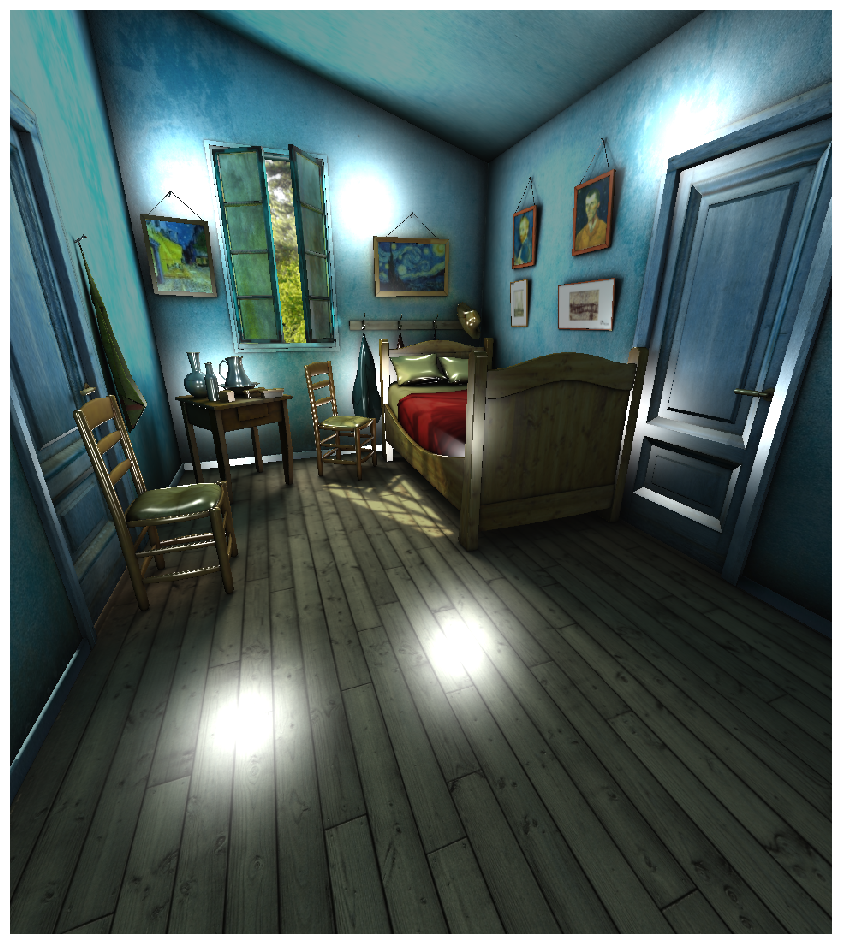
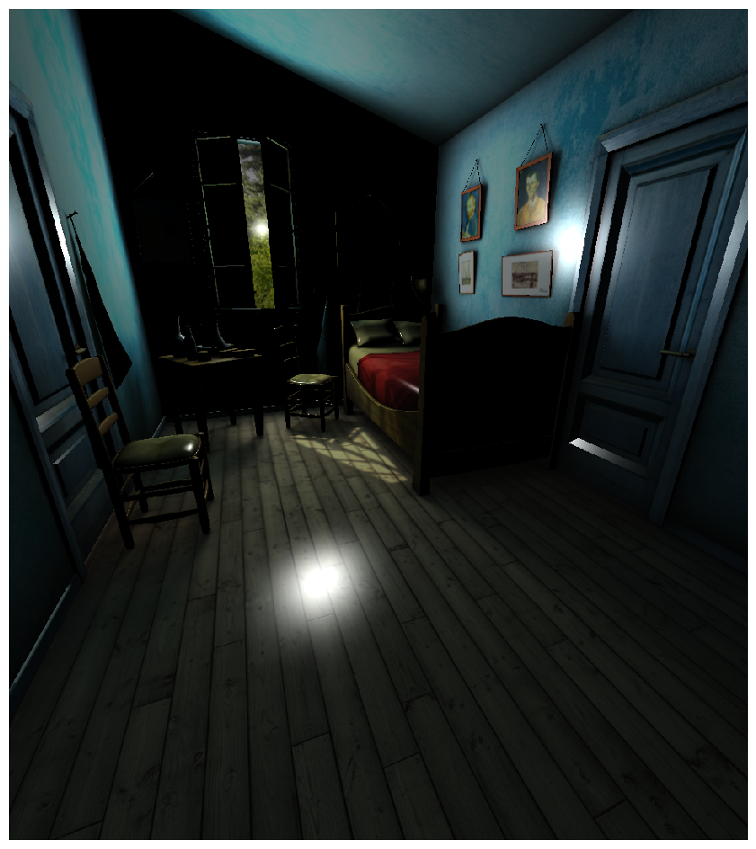
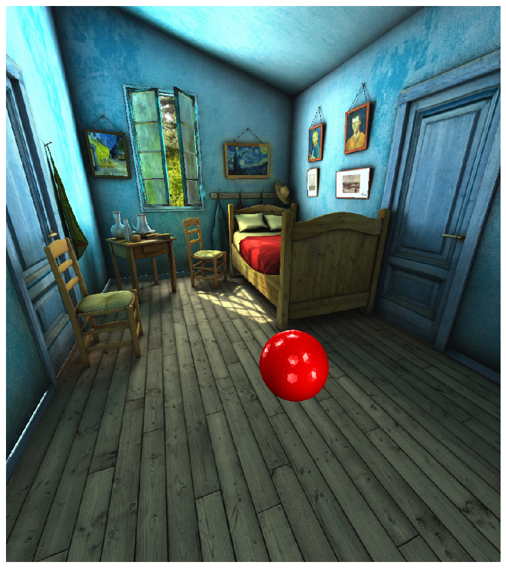
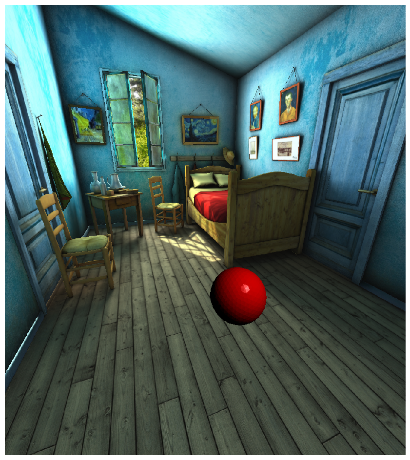
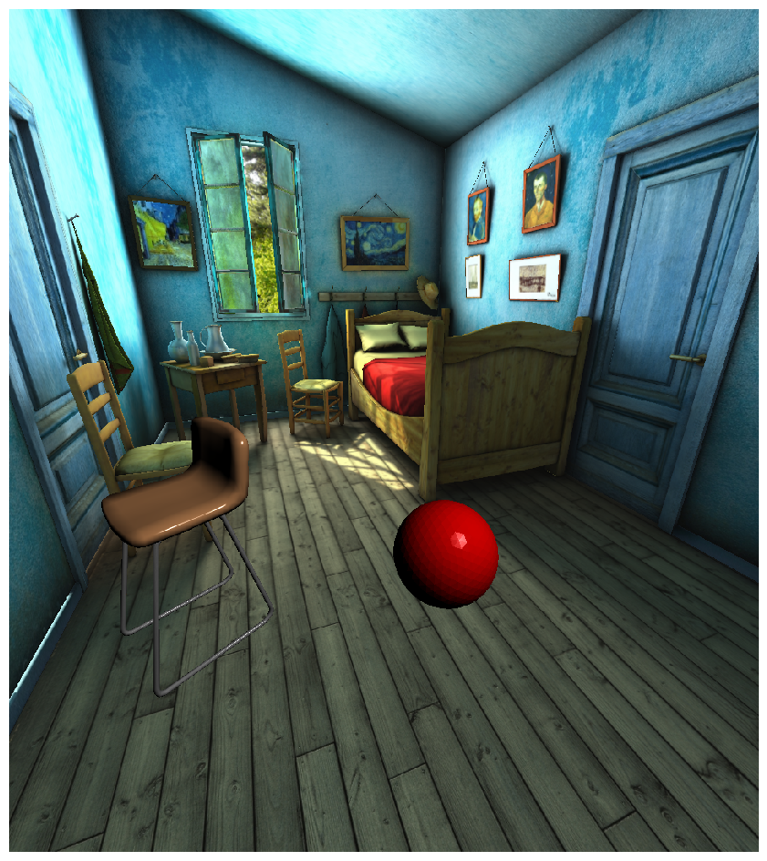
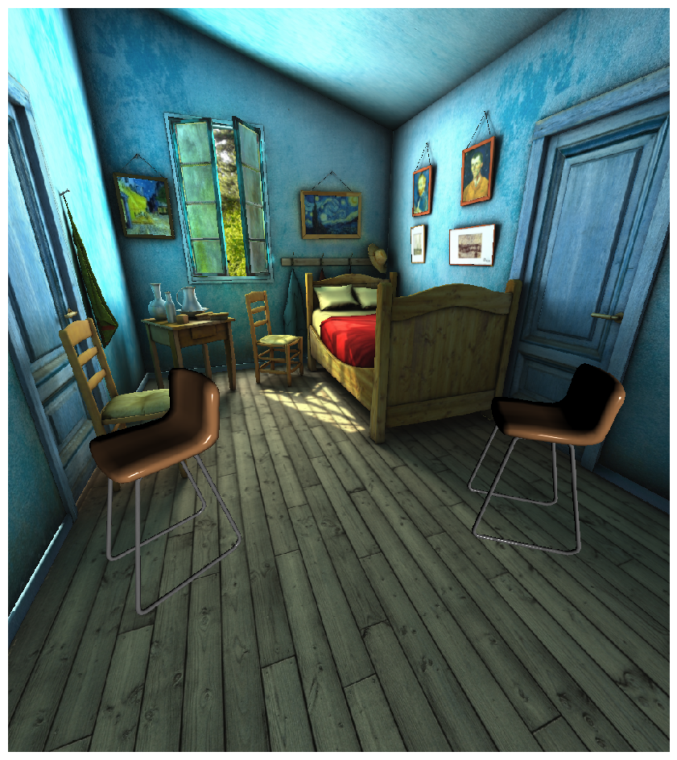
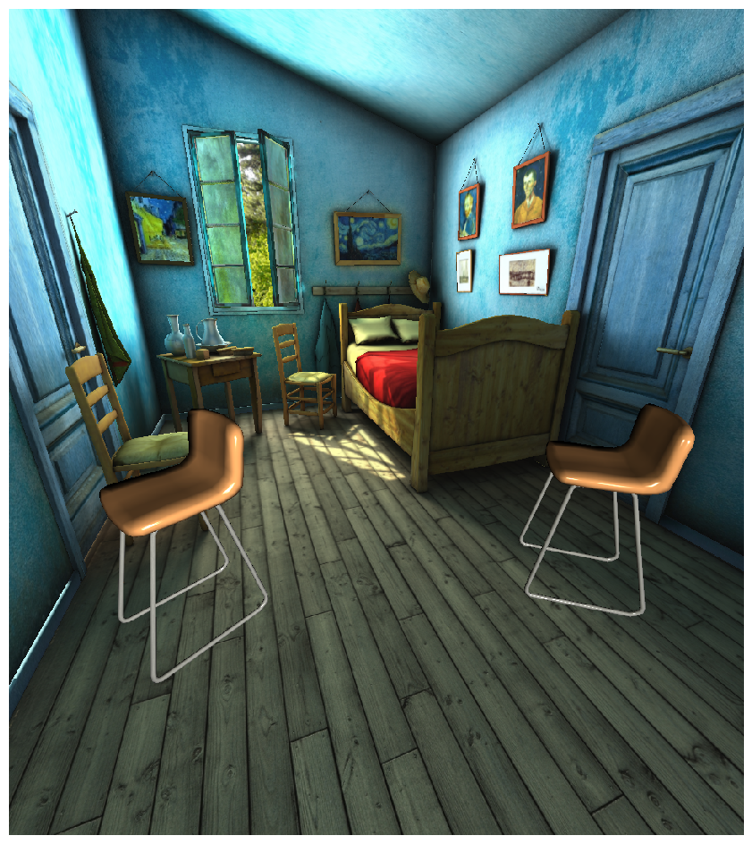

Working with Lights
###################

:summary: This tutorial demonstrates the creation and manipulation of LightSetups in Habitat-sim.

.. contents::
    :class: m-block m-default

A **LightSetup** consists of a set of LightInfo structures defining the common configuration
of a set of point lights used to render objects in a scene. Once defined and registered,
a LightSetup can be assigned to any subset of objects in the scene, including the scene asset itself.

Each **LightInfo** structure in a LightSetup defines the `color`, `position`, and `LightPositionModel` of a single point light source.
The LightPositionModel defines the coordinate frame of the light and can be set to any of:

.. code:: python

    habitat_sim.gfx.LightPositionModel.CAMERA
    habitat_sim.gfx.LightPositionModel.GLOBAL
    habitat_sim.gfx.LightPositionModel.OBJECT

Each LightSetup is registered in the simulator via a unique key. Two default lighting setups are pre-defined:

- **habitat_sim.gfx.DEFAULT_LIGHTING_KEY**

  8 white, GLOBAL lights at scene bounding box corners.

- **habitat_sim.gfx.NO_LIGHT_KEY**

  0 lights (for Flat shaded assets).

Additional custom setups can be created and registered via the **simulator.set_light_setup** function:

.. code:: python

    sim.set_light_setup(new_light_setup, "my_custom_lighting_key")

Any existing LightSetup can be queried with **simulator.get_light_setup**:

.. code:: python

    custom_light_setup = sim.set_light_setup(n"my_custom_lighting_key")

`Working with Lights Example:`_
===============================

The example code below demonstrates the usage of default and custom LightSetups and is runnable via:

.. code:: shell-session

    $ python examples/tutorials/lighting_tutorial.py

First, we import modules we will need, define some convenience functions, and initialize the Simulator, Agent, and objects.

.. include:: ../../examples/tutorials/lighting_tutorial.py
    :code: py
    :start-after: # [setup]
    :end-before: # [/setup]

`Scene Lighting`_
=================

By default, the scene will be shaded with no lights using the **habitat_sim.gfx.NO_LIGHT_KEY** LightSetup.
This configuration is ideal for scene assets with illumination baked into textures (e.g. building scans such as MP3D).

.. include:: ../../examples/tutorials/lighting_tutorial.py
    :code: py
    :start-after: # [default scene lighting]
    :end-before: # [scene swap shader]

To use a custom light setup for the scene, edit the **habitat_sim.SimulatorConfiguration.scene_light_setup**
option when creating/reconfiguring your Simulator. Note that
while you can modify the scene's LightSetup dynamically during runtime, you will need to
reconfigure the simulator to switch the scene's LightSetup key. Also, due to asset loading specifics
**you must close and re-initialize the Simulator to swap between Flat and Phong shading setups**.

.. include:: ../../examples/tutorials/lighting_tutorial.py
    :code: py
    :start-after: # [scene swap shader]
    :end-before: # [/scene]

.. |cp1| replace:: After loading with DEFAULT_LIGHTING_KEY.

.. |cp2| replace:: After swapping to custom "my_scene_lighting".

+---------+-----------+
|  |im1|  +   |im2|   +
|  |cp1|  +   |cp2|   +
+---------+-----------+

`Object Lighting`_
==================

By default, object assets are loaded with Phong shading compatability. This is not ideal for assets with illumination baked into textures.
Objects can be loaded for Flat shading by using the asset template's **PhysicsObjectAttributes.setRequiresLighting** function *before* loading the asset.
Alternatively, this option can be set in the object template's configuration file:

E.g. in *my_object.phys_properties.json*

.. code:: json

    {
        "render mesh": "my_object.glb",
        "requires lighting": false
    }

By default, new objects with Phong shading enabled are added to the scene with the **habitat_sim.gfx.DEFAULT_LIGHTING_KEY** LightSetup.

.. include:: ../../examples/tutorials/lighting_tutorial.py
    :code: py
    :start-after: # [example 2]
    :end-before: # [/example 2]

We can modify the default LightSetup by setting with an empty key.

.. include:: ../../examples/tutorials/lighting_tutorial.py
    :code: py
    :start-after: # [example 3]
    :end-before: # [/example 3]

Newly added objects will use the current default lighting.

.. include:: ../../examples/tutorials/lighting_tutorial.py
    :code: py
    :start-after: # [example 4]
    :end-before: # [/example 4]

`Multiple Light Setups`_
========================

To use multiple custom lighting setups at the same time, simply give them a name on creation.

.. include:: ../../examples/tutorials/lighting_tutorial.py
    :code: py
    :start-after: # [example 5]
    :end-before: # [/example 5]

To use this a light setup, pass in the name as a parameter to **Simulator.add_object**.

.. include:: ../../examples/tutorials/lighting_tutorial.py
    :code: py
    :start-after: # [example 6]
    :end-before: # [/example 6]

You can get a copy of an existing configuration with **Simulator.get_light_setup**.

.. include:: ../../examples/tutorials/lighting_tutorial.py
    :code: py
    :start-after: # [example 7]
    :end-before: # [/example 7]

Updates to existing light setups will update all objects using that setup

.. include:: ../../examples/tutorials/lighting_tutorial.py
    :code: py
    :start-after: # [example 8]
    :end-before: # [/example 8]

You can change the light setup any individual object uses at any time.

.. include:: ../../examples/tutorials/lighting_tutorial.py
    :code: py
    :start-after: # [example 9]
    :end-before: # [/example 9]

