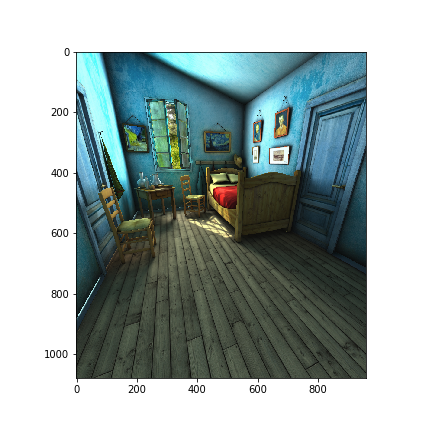
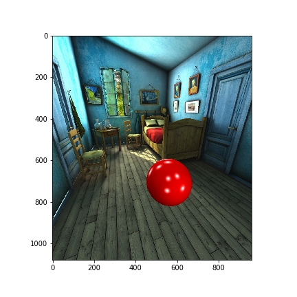
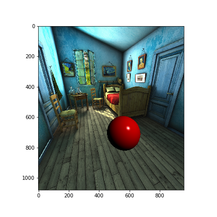
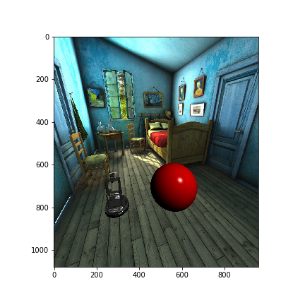
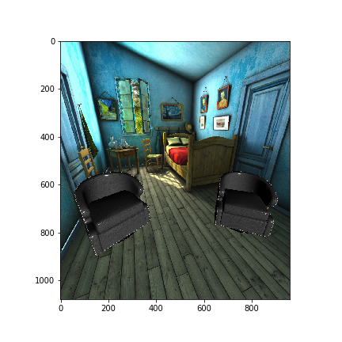
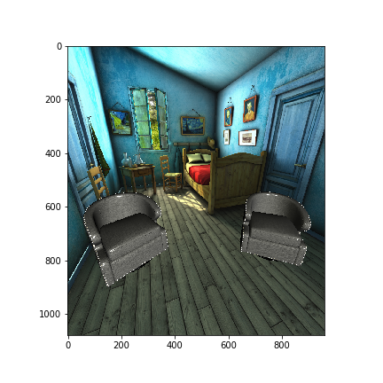

Configuring Light Setups
########################

.. contents::
    :class: m-block m-default

:summary: This example shows how to create and manipulate light setups in habitat-sim

`Imports`_
==========

First, we import libraries and lighting structures for later use
.. code:: py

    import math

    import magnum as mn
    import numpy as np
    from matplotlib import pyplot as plt

    import habitat_sim
    from habitat_sim.gfx import LightInfo, LightPositionModel
    from habitat_sim.utils.common import quat_from_angle_axis, quat_to_magnum

`Helper Functions and Constants`_
=================================

Next we define some simple helper functions and constants for later use.

.. code:: py

    def show_img(data):
        plt.figure(figsize=(12, 12))
        plt.imshow(data, interpolation='nearest')
        plt.show()

    def show_obs(sim):
        show_img(sim.get_sensor_observations()["rgba_camera"])

    def remove_all_objects(sim):
        for id in sim.get_existing_object_ids():
            sim.remove_object(id)

    x_axis = np.array([1, 0, 0])
    z_axis = np.array([0, 0, 1])
    y_axis = np.array([0, 1, 0])

`Simulator and Agent Configuration`_
====================================

Next we create a simulator and place our agent in the scene.

.. code:: py

    # simulator configuration
    backend_cfg = habitat_sim.SimulatorConfiguration()
    backend_cfg.scene.id = "data/scene_datasets/habitat-test-scenes/van-gogh-room.glb"
    backend_cfg.enable_physics = True

    # agent configuration
    sensor_cfg = habitat_sim.SensorSpec()
    sensor_cfg.resolution = [1080, 960]
    agent_cfg = habitat_sim.agent.AgentConfiguration()
    agent_cfg.sensor_specifications = [sensor_cfg]

    # create the simulator
    sim_cfg = habitat_sim.Configuration(backend_cfg, [agent_cfg])
    sim = habitat_sim.Simulator(sim_cfg)

    # place our agent in the scene
    agent_state = habitat_sim.AgentState()
    agent_state.position = [5.0, 0.0, 1.0]
    agent_state.rotation = quat_from_angle_axis(math.radians(70), y_axis) * quat_from_angle_axis(math.radians(-20), x_axis)
    agent = sim.initialize_agent(0, agent_state)
    agent_transform = agent.scene_node.transformation_matrix()

`Scene Lighting`_
=================

By default, the scene will be shaded with no lights.

.. code:: py

    show_obs(sim)

To use a non-default light setup for the scene, simply use the `sceneLightSetup` field of
`habitat_sim.SimulatorConfiguration` when creating/reconfiguring your Simulator.

`Default Object Lighting`_
==========================

By default, added objects will be phong shaded with lights at the corners of the scene
.. code:: py

    id_1 = sim.add_object(1)
    sim.set_translation(agent_transform.transform_point([0.3, 0.9, -1.8]), id_1)

    show_obs(sim)

We can update the default lighting
.. code:: py

    my_default_lighting = [LightInfo(position=[2.0, 2.0, 1.0], model=LightPositionModel.CAMERA)]

    sim.set_light_setup(my_default_lighting)

    show_obs(sim)

Newly added objects will use the current default lighting
.. code:: py

    id_2 = sim.add_object(3)
    sim.set_rotation(mn.Quaternion.rotation(mn.Rad(mn.Deg(80)), mn.Vector3.y_axis()), id_2)
    sim.set_translation(agent_transform.transform_point([-0.6, 0.9, -1.5]), id_2)

    show_obs(sim)

`Multiple Light Setups`_
========================

To use multiple custom lighting setups at the same time, simply give them a name on creation.
.. code:: py

    light_setup_2 = [LightInfo(position=[8.0, 1.5, 0.0], model=LightPositionModel.GLOBAL)]
    sim.set_light_setup(light_setup_2, "my_custom_lighting")

To use this a light setup, pass in the name as a parameter to `Simulator.add_object`.
.. code:: py

    remove_all_objects(sim)

    id_1 = sim.add_object(2, light_setup_key="my_custom_lighting")
    sim.set_rotation(mn.Quaternion.rotation(mn.Rad(mn.Deg(90)), mn.Vector3.x_axis()) *
                     mn.Quaternion.rotation(mn.Rad(mn.Deg(-115)), mn.Vector3.z_axis()), id_1)
    sim.set_translation(agent_transform.transform_point([-0.8, 1.05, -1.5]), id_1)

    id_2 = sim.add_object(2, light_setup_key="my_custom_lighting")
    sim.set_rotation(mn.Quaternion.rotation(mn.Rad(mn.Deg(90)), mn.Vector3.x_axis()) *
                     mn.Quaternion.rotation(mn.Rad(mn.Deg(-50)), mn.Vector3.z_axis()), id_2)
    sim.set_translation(agent_transform.transform_point([1.0, 1.05, -1.75]), id_2)

    show_obs(sim)

You can get a copy of an existing configuration with `Simulator.get_light_setup`.
.. code:: py

    existing_light_setup = sim.get_light_setup("my_custom_lighting")

Updates to existing light setups will update all objects using that setup
.. code:: py

    new_light_setup = existing_light_setup + [LightInfo(position=[0.0, 0.0, 0.0], color=[0.8, 0.8, 0.7], model=LightPositionModel.CAMERA)]
    sim.set_light_setup(new_light_setup, "my_custom_lighting")

    show_obs(sim)

You can change the light setup an individual object uses.
.. code:: py

    sim.set_object_light_setup(id_1, habitat_sim.gfx.DEFAULT_LIGHTING_KEY)

    show_obs(sim)
.. image:: change_object_light_setup.png
