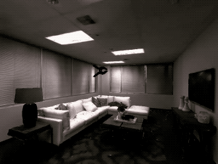
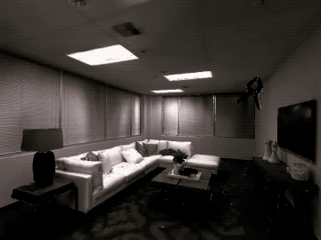
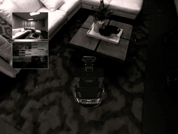
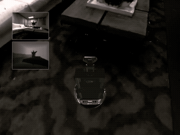

Interactive Rigid Objects via PhysicsObjectManager
##################################################

:ref-prefix:
    habitat_sim.simulator
    habitat_sim.sim
    habitat_sim.agent
    habitat_sim.attributes
    habitat_sim.scene

:summary: This tutorial demonstrates rigid object interactions in Habitat-sim -- instancing, dynamic simulation, and kinematic manipulation -- through direct object manipulation.

.. contents::
    :class: m-block m-default

The example code below is available on `Colab`_, or runnable via:

.. _Colab: https://colab.research.google.com/github/facebookresearch/habitat-sim/blob/main/examples/tutorials/colabs/managed_rigid_object_tutorial.ipynb

.. code:: shell-session

    $ python path/to/habitat-sim/examples/tutorials/nb_python/managed_rigid_object_tutorial.py

First, download the example objects used in this tutorial:

.. code:: shell-session

    $ python -m habitat_sim.utils.datasets_download --uids habitat_example_objects locobot_merged --data-path path/to/data/

Import necessary modules, define some convenience functions, and initialize the :ref:`Simulator` and :ref:`Agent`.

.. include:: ../../examples/tutorials/nb_python/managed_rigid_object_tutorial.py
    :code: py
    :start-after: # [setup]
    :end-before: # [/setup]

.. include:: ../../examples/tutorials/nb_python/managed_rigid_object_tutorial.py
    :code: py
    :start-after: # [initialize]
    :end-before: # [/initialize]

`Simulation Quickstart`_
========================

Basic rigid body simulation can be achieved by simply loading a template, instancing an object, and stepping the physical world.
In this example, a sphere object template is loaded and the object is instanced in the scene above the table.
When the simulation is stepped, it falls under the force of gravity and reacts to collisions with the scene.

.. include:: ../../examples/tutorials/nb_python/managed_rigid_object_tutorial.py
    :code: py
    :start-after: # [basics]
    :end-before: # [/basics]

.. image:: images/managed-rigid-object-tutorial-images/sim_basics.gif
    :width: 20em

User-defined configuration values can be set and retrieved for each object independently.  These values can be specified in the files used to build the :ref:`ObjectAttributes` that is used to create this object, or they can
be modified directly.

.. include:: ../../examples/tutorials/nb_python/managed_rigid_object_tutorial.py
    :code: py
    :start-after: # [object_user_configurations]
    :end-before: # [/object_user_configurations]

Forces and torques can be applied directly to the object using :ref:`habitat_sim.physics.ManagedRigidObject.apply_force` and :ref:`habitat_sim.physics.ManagedRigidObject.apply_torque`.
Instantanious initial velocities can also be set using the object's properties, :ref:`habitat_sim.physics.ManagedRigidObject.linear_velocity` and :ref:`habitat_sim.physics.ManagedRigidObject.angular_velocity`.

In the example below, a constant anti-gravity force is applied to the boxes' centers of mass (COM) causing them to float in the air.
A constant torque is also applied which gradually increases the angular velocity of the boxes.
A sphere is then thrown at the boxes by applying an initial velocity.

Note that forces and torques are treated as constant within each call to :ref:`Simulator.step_physics` and are cleared afterward.

.. include:: ../../examples/tutorials/nb_python/managed_rigid_object_tutorial.py
    :code: py
    :start-after: # [dynamic_control]
    :end-before: # [/dynamic_control]

.. image:: images/managed-rigid-object-tutorial-images/dynamic_control.gif
    :width: 20em

`Kinematic Object Placement`_
=============================

Often it is enough to set the desired state of an object directly.
In these cases the computational overhead of running full dynamic simulation may not be necessary to achieve a desired result.
An object's motion type can be set to :ref:`habitat_sim.physics.MotionType.KINEMATIC` directly through its :ref:`habitat_sim.physics.ManagedRigidObject.motion_type` property, which specifies that the object's state will be directly controlled.

In the example below, a kinematic can is placed in the scene which will not react to physical events such as collision with dynamically simulated objects.
However, it will still act as a collision object for other scene objects as in the following example.

.. include:: ../../examples/tutorials/nb_python/managed_rigid_object_tutorial.py
    :code: py
    :start-after: # [kinematic_interactions]
    :end-before: # [/kinematic_interactions]

.. image:: images/managed-rigid-object-tutorial-images/kinematic_interactions.gif
    :width: 20em

`Kinematic Velocity Control`_
=============================

To move a kinematic object, the state can be set directly before each simulation step.
This is useful for synchronizing the simulation state of objects to a known state such as a dataset trajectory, input device, or motion capture.

.. include:: ../../examples/tutorials/nb_python/managed_rigid_object_tutorial.py
    :code: py
    :start-after: # [kinematic_update]
    :end-before: # [/kinematic_update]

However, when applying model or algorithmic control it is more convenient to specify a constant linear and angular velocity for the object which will be simulated without manual integration.
The object's :ref:`habitat_sim.physics.VelocityControl` structure provides this functionality and can be acquired directly from the object via the read only property :ref:`habitat_sim.physics.ManagedRigidObject.velocity_control`.
Once paramters are set, control takes effect immediately on the next simulation step as shown in the following example.

.. include:: ../../examples/tutorials/nb_python/managed_rigid_object_tutorial.py
    :code: py
    :start-after: # [velocity_control]
    :end-before: # [/velocity_control]

.. image:: images/managed-rigid-object-tutorial-images/velocity_control.gif
    :width: 20em

Velocities can also be specified in the local space of the object to easily apply velocity control for continuous agent actions.

.. include:: ../../examples/tutorials/nb_python/managed_rigid_object_tutorial.py
    :code: py
    :start-after: # [local_velocity_control]
    :end-before: # [/local_velocity_control]

`Embodied Agents`_
==================

Previous stages of this tutorial have covered adding objects to the world and manipulating them by setting positions, velocity, forces, and torques.
In all of these examples, the agent has been a passive onlooker observing the scene.
However, the agent can also be attached to a simulated object for embodiement and control.
This can be done by passing the :ref:`Agent`'s scene node to the :ref:`habitat_sim.physics.RigidObjectManager.add_object_by_template_handle` or :ref:`habitat_sim.physics.RigidObjectManager.add_object_by_template_id` functions.

In this example, the agent is embodied by a rigid robot asset and the :ref:`habitat_sim.physics.VelocityControl` structure is used to control the robot's actions.

.. include:: ../../examples/tutorials/nb_python/managed_rigid_object_tutorial.py
    :code: py
    :start-after: # [embodied_agent]
    :end-before: # [/embodied_agent]

`Continuous Control on NavMesh`_
================================

Instead of full dynamic simulation, kinematic state setting and the NavMesh can be used to simulate constrained, continuous navigation tasks.
In this example the agent is embodied by a robot asset with :ref:`habitat_sim.physics.MotionType.KINEMATIC`. We use a :ref:`habitat_sim.physics.VelocityControl` structure to manually integrate a control velocity and snap the resulting state to the NavMesh before running dynamic simulation.
We run this example scenario twice. The first iteration we configure the NavMesh to allow sliding, while the second iteration is configured to dis-allow sliding.

.. include:: ../../examples/tutorials/nb_python/managed_rigid_object_tutorial.py
    :code: py
    :start-after: # [embodied_agent_navmesh]
    :end-before: # [/embodied_agent_navmesh]

With NavMesh sliding allowed:

With NavMesh sliding dis-allowed:

.. image:: images/managed-rigid-object-tutorial-images/robot_control_no_sliding.gif
    :width: 20em

`Feature Detail Review`_
========================

Adding/Removing Objects
***********************

Objects can be instanced from templates (i.e. :ref:`ObjectAttributes`) into the scene by template id with :ref:`habitat_sim.physics.RigidObjectManager.add_object_by_template_id` or by template string key with :ref:`habitat_sim.physics.RigidObjectManager.add_object_by_template_handle`.
These functions return a reference to the added object instance. In the case of errors in construction, an invalid reference is returned.

By default, a new :ref:`SceneNode` will be created when an object is instanced. However, the object can be attached to an existing :ref:`SceneNode` (e.g. that of the :ref:`Agent`) if provided. This is demonstrated in `Embodied Agents`_.

Object instances can be removed by id with :ref:`habitat_sim.physics.RigidObjectManager.remove_object_by_id` or by handle with :ref:`habitat_sim.physics.RigidObjectManager.remove_object_by_handle`.
Optionally, the object's :ref:`SceneNode` can be left behind in the :ref:`SceneGraph` when it is removed (e.g. to prevent deletion of an embodied :ref:`Agent`'s :ref:`SceneNode`).

:ref:`habitat_sim.physics.RigidObjectManager.get_object_handles` will return a list of the string handles for all the existing objects in the scene.

MotionType
**********

Objects can be configured to fill different roles in a simulated scene by assigning a :ref:`habitat_sim.physics.MotionType`:

- :ref:`habitat_sim.physics.MotionType.DYNAMIC`

  Dynamic object states are driven by simulation. These objects are affected by scene forces such as gravity, collision impulses, and programmatically applied forces and torques.

  Constant forces and torques can be applied to these objects with :ref:`habitat_sim.physics.ManagedRigidObject.apply_force` and :ref:`habitat_sim.physics.ManagedRigidObject.apply_torque`.
  These are cleared after each call to :ref:`Simulator.step_physics`.

  Instantanious initial velocities can also be set for these objects using their :ref:`habitat_sim.physics.ManagedRigidObject.linear_velocity` and :ref:`habitat_sim.physics.ManagedRigidObject.angular_velocity` properties.

- :ref:`habitat_sim.physics.MotionType.KINEMATIC`

  Kinematic object states are not affected by scene dynamics, but can be set directly via the object's :ref:`habitat_sim.physics.ManagedRigidObject.transformation`, :ref:`habitat_sim.physics.ManagedRigidObject.rotation`, and :ref:`habitat_sim.physics.ManagedRigidObject.translation` properties.

- :ref:`habitat_sim.physics.MotionType.STATIC`

  Static object states are not expected to change and cannot be affected by scene dynamics or programmatic state setters.

VelocityControl
***************

Each object's :ref:`habitat_sim.physics.VelocityControl` structure provides a simple interface for setting up continuous velocity control of the object in either the global or local coordinate frame.
This can be queried from the simulator with :ref:`habitat_sim.physics.ManagedRigidObject.velocity_control`.

For :ref:`habitat_sim.physics.MotionType.KINEMATIC` objects, velocity control will directly modify the object's rigid state.

For :ref:`habitat_sim.physics.MotionType.DYNAMIC` object, velocity control will set the initial velocity of the object before simualting.
In this case, velocity will be more accurate with smaller timestep requests to :ref:`Simulator.step_physics`.
Note that dynamics such as forces, collisions, and gravity will affect these objects, but expect extreme damping as velocities are being manually set before each timestep when controlled.
