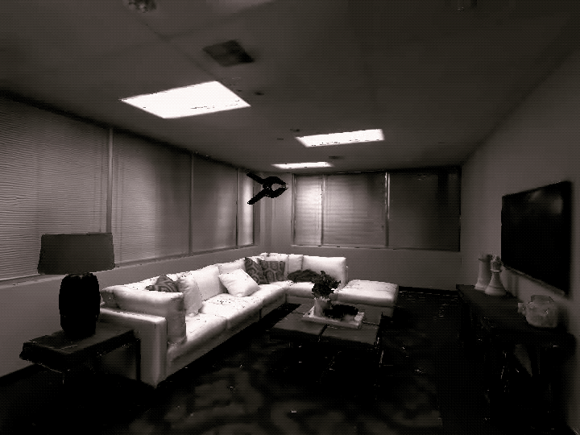
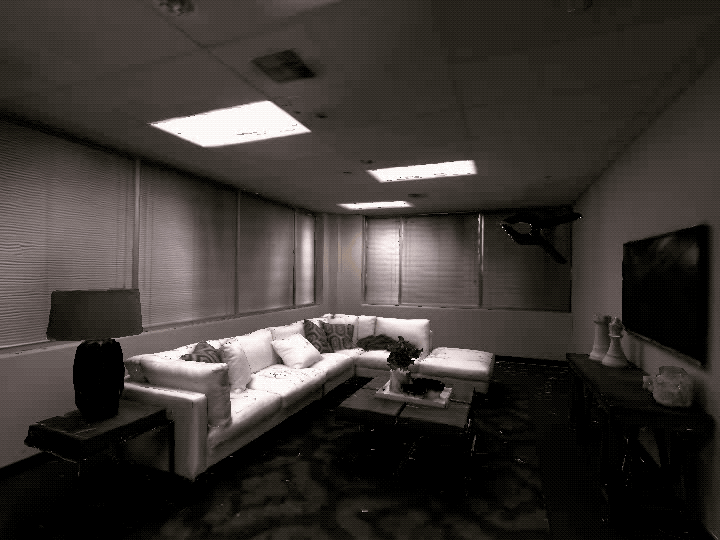
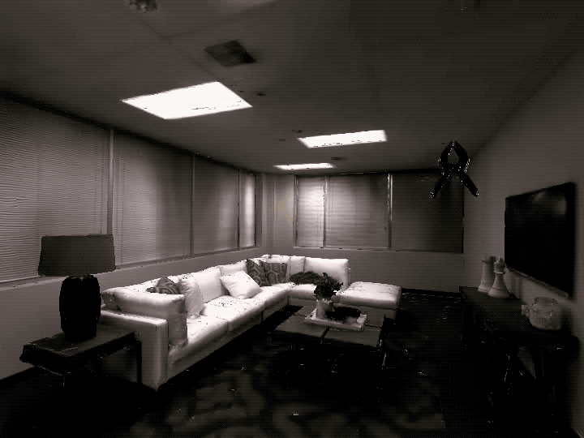

:ref-prefix:
    habitat_sim.simulator
    habitat_sim.sim
    habitat_sim.agent
    habitat_sim.attributes

Interactive Rigid Objects
#########################

:summary: This tutorial demonstrates rigid object interactions in Habitat-sim -- instancing, dynamic simulation, and kinematic manipulation.

.. contents::
    :class: m-block m-default

First, download the `example objects`_ and extract them into path/to/habitat-sim/data/objects/.

.. _example objects: http://dl.fbaipublicfiles.com/habitat/objects_v0.1.zip

The example code below is runnable via:

.. code:: shell-session

    $ python path/to/habitat-sim/examples/tutorials/rigid_object_tutorial.py

Import necessary modules, define some convenience functions, and initialize the :ref:`Simulator` and :ref:`Agent`.

.. include:: ../../examples/tutorials/rigid_object_tutorial.py
    :code: py
    :start-after: # [setup]
    :end-before: # [/setup]

.. include:: ../../examples/tutorials/rigid_object_tutorial.py
    :code: py
    :start-after: # [initialize]
    :end-before: # [/initialize]

`Simulation Quickstart`_
========================

Basic rigid body simulation can be achieved by simply loading a template, instancing an object, and stepping the physical world.
In this example, a sphere object template is loaded and the object is instanced in the scene above the table.
When the simulation is stepped, it falls under the force of gravity and reacts to collisions with the scene.

.. include:: ../../examples/tutorials/rigid_object_tutorial.py
    :code: py
    :start-after: # [basics]
    :end-before: # [/basics]

.. image:: images/rigid-object-tutorial-images/sim_basics.gif
    :width: 20em

Forces and torques can be applied to the object with :ref:`Simulator.apply_force` and :ref:`Simulator.apply_torque`.
Instantanious initial velocities can also be set with :ref:`Simulator.set_linear_velocity` and :ref:`Simulator.set_angular_velocity`.

In the example below, a constant anti-gravity force is applied to the boxes' centers of mass (COM) causing them to float in the air.
A constant torque is also applied which gradually increases the angular velocity of the boxes.
A sphere is then thrown at the boxes by applying an initial velocity.

Note that forces and torques are treated as constant within each call to :ref:`Simulator.step_physics` and are cleared afterward.

.. include:: ../../examples/tutorials/rigid_object_tutorial.py
    :code: py
    :start-after: # [dynamic_control]
    :end-before: # [/dynamic_control]

.. image:: images/rigid-object-tutorial-images/dynamic_control.gif
    :width: 20em

`Kinematic Object Placement`_
=============================

Often it is enough to set the desired state of an object directly.
In these cases the computational overhead of running full dynamic simulation may not be necessary to achieve a desired result.
Setting the object to :ref:`habitat_sim.physics.MotionType.KINEMATIC` with :ref:`Simulator.set_object_motion_type` specifies that the object's state will be directly controlled.

In the example below, a kinematic can is placed in the scene which will not react to physical events such as collision with dynamically simulated objects.
However, it will still act as a collision object for other scene objects as in the following example.

.. include:: ../../examples/tutorials/rigid_object_tutorial.py
    :code: py
    :start-after: # [kinematic_interactions]
    :end-before: # [/kinematic_interactions]

.. image:: images/rigid-object-tutorial-images/kinematic_interactions.gif
    :width: 20em

`Kinematic Velocity Control`_
=============================

To move a kinematic object, the state can be set directly before each simulation step.
This is useful for synchronizing the simulation state of objects to a known state such as a dataset trajectory, input device, or motion capture.

.. include:: ../../examples/tutorials/rigid_object_tutorial.py
    :code: py
    :start-after: # [kinematic_update]
    :end-before: # [/kinematic_update]

However, when applying model or algorithmic control it is more convenient to specify a constant linear and angular velocity for the object which will be simulated without manual integration.
The object's :ref:`habitat_sim.physics.VelocityControl` structure provides this functionality and can be acquired via :ref:`Simulator.get_object_velocity_control`.
Once paramters are set, control takes affect immediately on the next simulation step as shown in the following example.

.. include:: ../../examples/tutorials/rigid_object_tutorial.py
    :code: py
    :start-after: # [velocity_control]
    :end-before: # [/velocity_control]

Velocities can also be specified in the local space of the object to easily apply velocity control for continuous agent actions.

.. include:: ../../examples/tutorials/rigid_object_tutorial.py
    :code: py
    :start-after: # [local_velocity_control]
    :end-before: # [/local_velocity_control]

`Embodied Agents`_
==================

For this tutorial section, you will need to download the `merged locobot asset`_ and unzip into path/to/habitat-sim/data/objects/

.. _merged locobot asset: http://dl.fbaipublicfiles.com/habitat/locobot_merged.zip

This tutorial has covered adding objects to the world and manipulating them by setting positions, velocity, forces, and torques.

`Feature Detail Review`_
========================

Objects can be configured to fill different roles in a simulated scene by assigning a :ref:`habitat_sim.physics.MotionType`:

- :ref:`habitat_sim.physics.MotionType.DYNAMIC`

  Dynamic object states are driven by simulation. These objects are affected by scene forces such as gravity, collision impulses, and programmatically applied forces and torques.

  Constant forces and torques can be applied to these objects with :ref:`Simulator.apply_force` and :ref:`Simulator.apply_torque`.
  These are cleared after each call to :ref:`Simulator.step_physics`.

  Instantanious initial velocities can also be set for these objects with :ref:`Simulator.set_linear_velocity` and :ref:`Simulator.set_angular_velocity`.

- :ref:`habitat_sim.physics.MotionType.KINEMATIC`

  Kinematic object states are not affected by scene dynamics, but can be set directly via :ref:`Simulator.set_transformation`, :ref:`Simulator.set_rotation`, and :ref:`Simulator.set_translation`.

- :ref:`habitat_sim.physics.MotionType.STATIC`

  Static object states are not expected to change and cannot be affected by scene dynamics or programmatic state setters.

Each object's :ref:`habitat_sim.physics.VelocityControl` structure provides a simple interface for setting up continuous velocity control of the object in either the global or local coordinate frame.
This can be queried from the simulator with :ref:`Simulator.get_object_velocity_control`.

For :ref:`habitat_sim.physics.MotionType.KINEMATIC` objects, velocity control will directly modify the object's rigid state.

For :ref:`habitat_sim.physics.MotionType.DYNAMIC` object, velocity control will set the initial velocity of the object before simualting.
In this case, velocity will be more accurate with smaller timestep requests to :ref:`Simulator.step_physics`.
