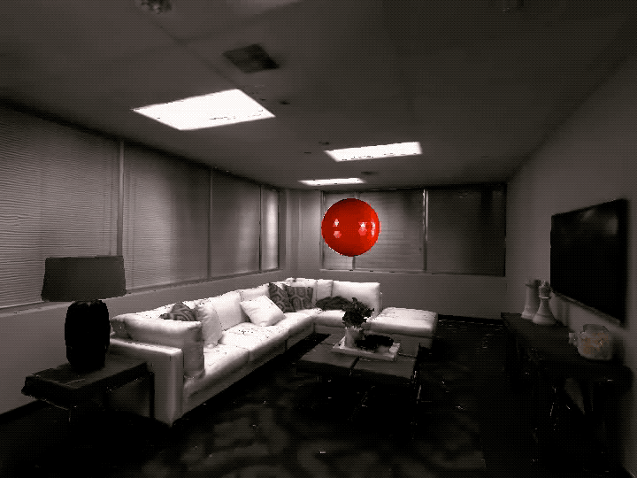
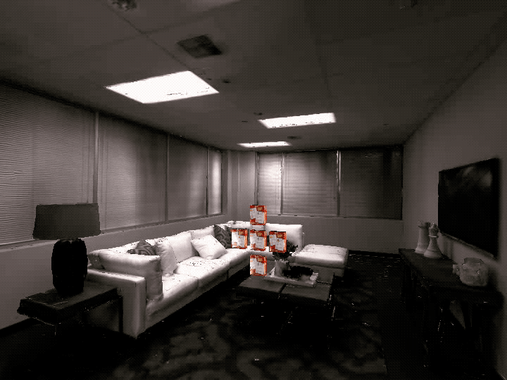
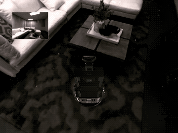
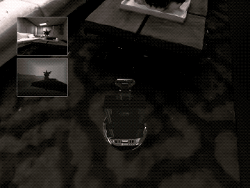

Voxelization Framework
#########################

:ref-prefix:
    habitat_sim.simulator
    habitat_sim.sim
    habitat_sim.agent
    habitat_sim.attributes
    habitat_sim.scene

:summary: This tutorial demonstrates the use of habitat-sim's voxelization framework.

.. contents::
    :class: m-block m-default

The example code below is  runnable via:

.. code:: shell-session

    $ python path/to/habitat-sim/examples/tutorials/voxel_framework_tutorial.py

Import necessary modules, define some convenience functions, and initialize the :ref:`Simulator` and :ref:`Agent`.

.. include:: ../../examples/tutorials/voxel_framework_tutorial.py
    :code: py
    :start-after: # [setup]
    :end-before: # [/setup]

.. include:: ../../examples/tutorials/voxel_framework_tutorial.py
    :code: py
    :start-after: # [initialize]
    :end-before: # [/initialize]

`Object Voxelization`_
========================

Objects can easily be voxelized to a specified resolution, where resolution represents the approximate number of voxels for that object's voxel grid.
Here, we'll spawn in three donuts and voxelize them with resolutions of 100000, 1000, and 100.

.. include:: ../../examples/tutorials/voxel_framework_tutorial.py
    :code: py
    :start-after: # [objectVoxelization]
    :end-before: # [/objectVoxelization]

`Stage Voxelization`_
========================

In addition to individual objects, the stage can be voxelized to a certain resolution.
Here, we'll voxelize the stage with a resolution of 2,000,000 and display the resulting boundary voxelization.

.. include:: ../../examples/tutorials/voxel_framework_tutorial.py
    :code: py
    :start-after: # [stageVoxelization]
    :end-before: # [/stageVoxelization]

`Voxelization Signed Distance Field`_
======================================

In some cases, it can be helpful to get an idea of which parts of the room are considered 'free space', meaning they are inside a room and are far from obstacles.
We can accomplish this by generating a signed distance field of the voxelization we just created. This voxelization framework also allows for the visualization of individual slices of this voxelization along the x-axis.
The voxelization framework is capable of creating boolean, integer, floating point, and Magnum Vector3 grids.
There are built-in utility functions for creating these grids, including generate_euclidean_distance_sdf which creates a Vector3 grid called "ClosestBoundaryCell"

.. include:: ../../examples/tutorials/voxel_framework_tutorial.py
    :code: py
    :start-after: # [voxelizationSDF]
    :end-before: # [/voxelizationSDF]

.. image:: images/rigid-object-tutorial-images/kinematic_interactions.gif
    :width: 20em

`Embodied Agents`_
==================

For this tutorial section, you will need to download the `merged locobot asset`_ and extract it into path/to/habitat-sim/data/objects/

.. _merged locobot asset: http://dl.fbaipublicfiles.com/habitat/locobot_merged_v0.2.zip

Previous stages of this tutorial have covered adding objects to the world and manipulating them by setting positions, velocity, forces, and torques.
In all of these examples, the agent has been a passive onlooker observing the scene.
However, the agent can also be attached to a simulated object for embodiement and control.
This can be done by passing the :ref:`Agent`'s scene node to the :ref:`Simulator.add_object` function.

In this example, the agent is embodied by a rigid robot asset and the :ref:`habitat_sim.physics.VelocityControl` structure is used to control the robot's actions.

.. include:: ../../examples/tutorials/nb_python/rigid_object_tutorial.py
    :code: py
    :start-after: # [embodied_agent]
    :end-before: # [/embodied_agent]

`Continuous Control on NavMesh`_
================================

For this tutorial section, if you have not done so, you will need to download the `merged locobot asset`_ and extract it into path/to/habitat-sim/data/objects/

.. _merged locobot asset: http://dl.fbaipublicfiles.com/habitat/locobot_merged_v0.2.zip

Instead of full dynamic simulation, kinematic state setting and the NavMesh can be used to simulate constrained, continuous navigation tasks.
In this example the agent is embodied by a robot asset with :ref:`habitat_sim.physics.MotionType.KINEMATIC`. We use a :ref:`habitat_sim.physics.VelocityControl` structure to manually integrate a control velocity and snap the resulting state to the NavMesh before running dynamic simulation.
We run this example scenario twice. The first iteration we configure the NavMesh to allow sliding, while the second iteration is configured to dis-allow sliding.

.. include:: ../../examples/tutorials/nb_python/rigid_object_tutorial.py
    :code: py
    :start-after: # [embodied_agent_navmesh]
    :end-before: # [/embodied_agent_navmesh]

With NavMesh sliding allowed:

.. image:: images/rigid-object-tutorial-images/robot_control_sliding.gif
    :width: 20em

With NavMesh sliding dis-allowed:

`Feature Detail Review`_
========================

Adding/Removing Objects
***********************

Objects can be instanced from templates (i.e. :ref:`ObjectAttributes`) into the scene by template id with :ref:`Simulator.add_object` or by template string key with :ref:`Simulator.add_object_by_handle`.
These functions return a unique id which can be used to refer to the object instance. In the case of errors in construction, -1 is returned.

By default, a new :ref:`SceneNode` will be created when an object is instanced. However, the object can be attached to an existing :ref:`SceneNode` (e.g. that of the :ref:`Agent`) if provided. This is demonstrated in `Embodied Agents`_.

Object instances can be removed by id with :ref:`Simulator.remove_object`. Optionally, the object's :ref:`SceneNode` can be left behind in the :ref:`SceneGraph` when it is removed (e.g. to prevent deletion of an embodied :ref:`Agent`'s :ref:`SceneNode`).

:ref:`Simulator.get_existing_object_ids` will return a list of unique object ids for all objects instanced in the scene.

MotionType
**********

Objects can be configured to fill different roles in a simulated scene by assigning a :ref:`habitat_sim.physics.MotionType`:

- :ref:`habitat_sim.physics.MotionType.DYNAMIC`

  Dynamic object states are driven by simulation. These objects are affected by scene forces such as gravity, collision impulses, and programmatically applied forces and torques.

  Constant forces and torques can be applied to these objects with :ref:`Simulator.apply_force` and :ref:`Simulator.apply_torque`.
  These are cleared after each call to :ref:`Simulator.step_physics`.

  Instantanious initial velocities can also be set for these objects with :ref:`Simulator.set_linear_velocity` and :ref:`Simulator.set_angular_velocity`.

- :ref:`habitat_sim.physics.MotionType.KINEMATIC`

  Kinematic object states are not affected by scene dynamics, but can be set directly via :ref:`Simulator.set_transformation`, :ref:`Simulator.set_rotation`, and :ref:`Simulator.set_translation`.

- :ref:`habitat_sim.physics.MotionType.STATIC`

  Static object states are not expected to change and cannot be affected by scene dynamics or programmatic state setters.

VelocityControl
***************

Each object's :ref:`habitat_sim.physics.VelocityControl` structure provides a simple interface for setting up continuous velocity control of the object in either the global or local coordinate frame.
This can be queried from the simulator with :ref:`Simulator.get_object_velocity_control`.

For :ref:`habitat_sim.physics.MotionType.KINEMATIC` objects, velocity control will directly modify the object's rigid state.

For :ref:`habitat_sim.physics.MotionType.DYNAMIC` object, velocity control will set the initial velocity of the object before simualting.
In this case, velocity will be more accurate with smaller timestep requests to :ref:`Simulator.step_physics`.
Note that dynamics such as forces, collisions, and gravity will affect these objects, but expect extreme damping as velocities are being manually set before each timestep when controlled.
