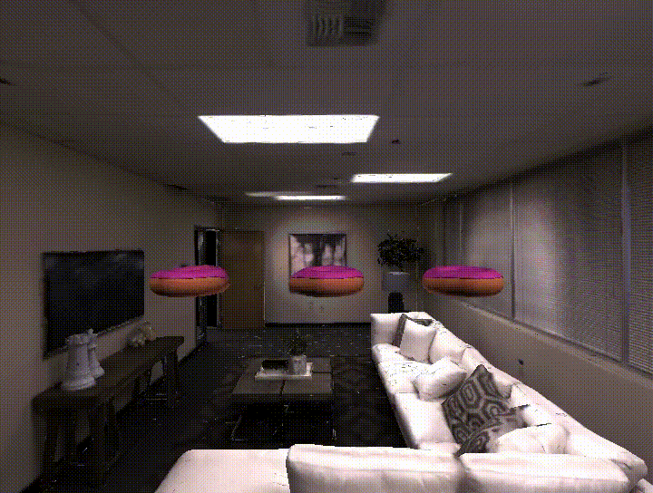
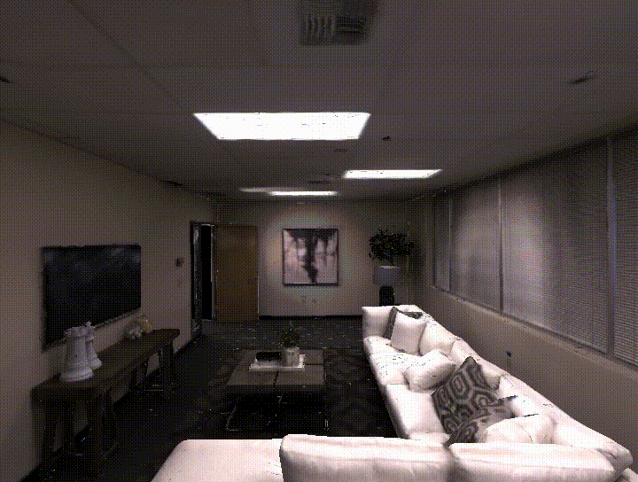
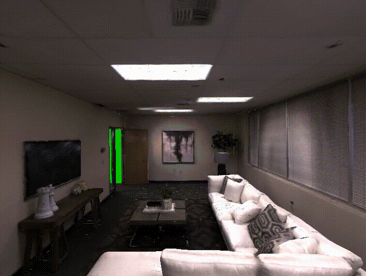
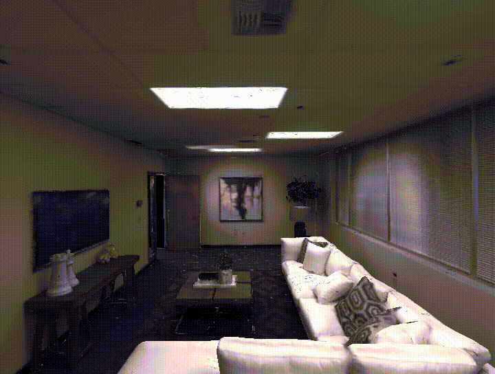
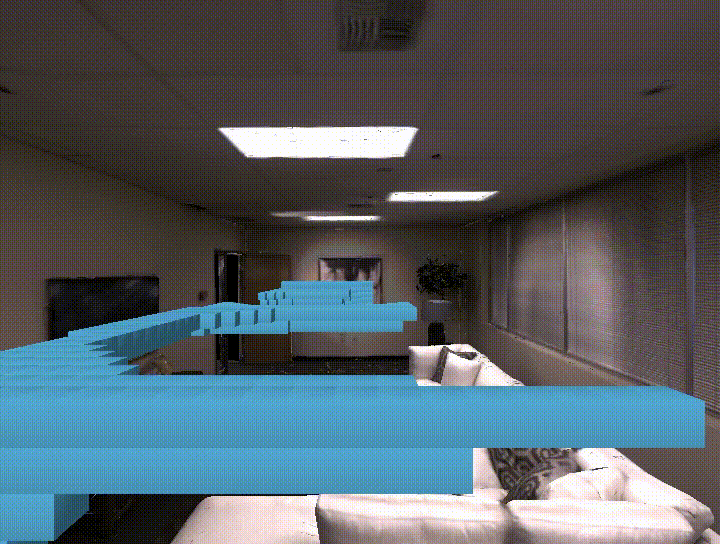

Voxelization Framework
#########################

:ref-prefix:
    habitat_sim.simulator
    habitat_sim.sim
    habitat_sim.agent
    habitat_sim.attributes
    habitat_sim.scene

:summary: This tutorial demonstrates the use of habitat-sim's voxelization framework.

.. contents::
    :class: m-block m-default

The example code below is  runnable via:

.. code:: shell-session

    $ python path/to/habitat-sim/examples/tutorials/voxel_framework_tutorial.py

Import necessary modules, define some convenience functions, and initialize the :ref:`Simulator` and :ref:`Agent`.

.. include:: ../../examples/tutorials/voxel_framework_tutorial.py
    :code: py
    :start-after: # [setup]
    :end-before: # [/setup]

.. include:: ../../examples/tutorials/voxel_framework_tutorial.py
    :code: py
    :start-after: # [initialize]
    :end-before: # [/initialize]

`Object Voxelization`_
========================

Objects can easily be voxelized to a specified resolution, where resolution represents the approximate number of voxels for that object's voxel grid.
Here, we'll spawn in three donuts and voxelize them with resolutions of 100000, 1000, and 100.

.. include:: ../../examples/tutorials/voxel_framework_tutorial.py
    :code: py
    :start-after: # [objectVoxelization]
    :end-before: # [/objectVoxelization]

`Stage Voxelization`_
========================

In addition to individual objects, the stage can be voxelized to a certain resolution.
Here, we'll voxelize the stage with a resolution of 2,000,000 and display the resulting boundary voxelization.

.. include:: ../../examples/tutorials/voxel_framework_tutorial.py
    :code: py
    :start-after: # [stageVoxelization]
    :end-before: # [/stageVoxelization]

`Voxelization Signed Distance Field`_
======================================

In some cases, it can be helpful to get an idea of which parts of the room are considered 'free space', meaning they are inside a room and are far from obstacles.
We can accomplish this by generating a signed distance field of the voxelization we just created. This voxelization framework also allows for the visualization of individual slices of this voxelization along the x-axis.
The voxelization framework is capable of creating boolean, integer, floating point, and Magnum Vector3 grids.
There are built-in utility functions for creating these grids, including generate_euclidean_distance_sdf which creates a Vector3 grid called "ClosestBoundaryCell"

.. include:: ../../examples/tutorials/voxel_framework_tutorial.py
    :code: py
    :start-after: # [voxelizationSDF]
    :end-before: # [/voxelizationSDF]

`Voxelization Distance Gradient Field`_
=======================================

Additionally, there is a built-in utility function for generating a gradient vector field given some scalar field (int or float).
This is illustrated below, where we generate a distance gradient field. We then are able to generate a mesh for the field and visualize it.

.. include:: ../../examples/tutorials/voxel_framework_tutorial.py
    :code: py
    :start-after: # [voxelizationDistanceGradient]
    :end-before: # [/voxelizationDistanceGradient]

`Custom Voxel Grids`_
======================

Finally, let's experiment with custom-created voxel grids. We'll start out by creating a new bool grid, and filling each voxel as true if its corresponding value in the euclidean signed distance field is less than -12.

.. include:: ../../examples/tutorials/voxel_framework_tutorial.py
    :code: py
    :start-after: # [voxelizationCustomGrid]
    :end-before: # [/voxelizationCustomGrid]

